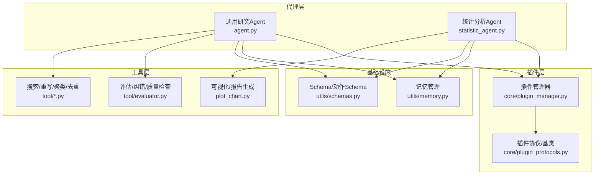
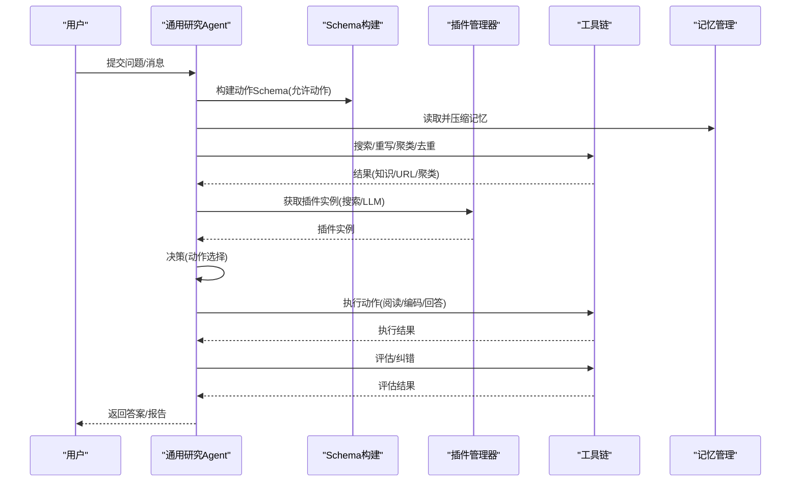
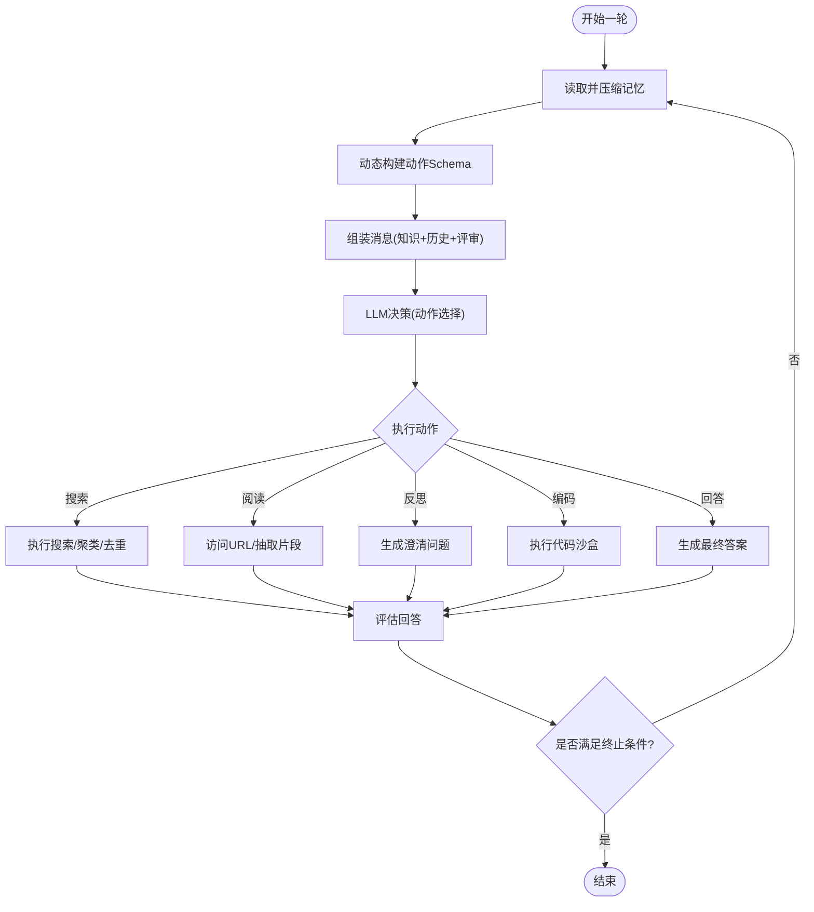
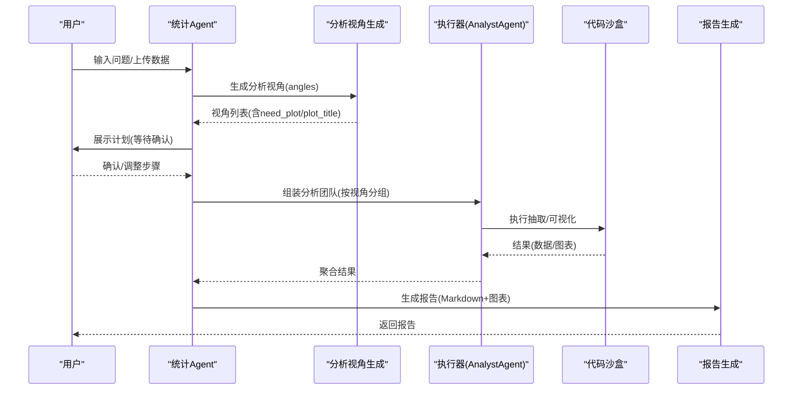
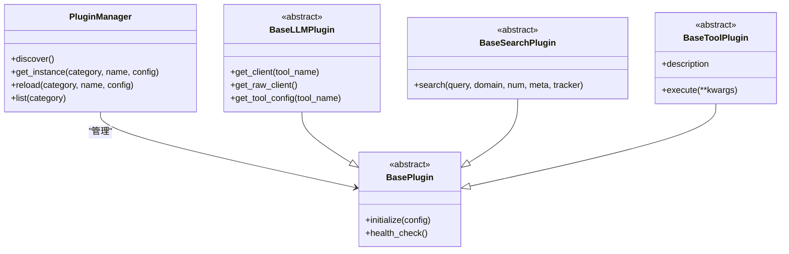
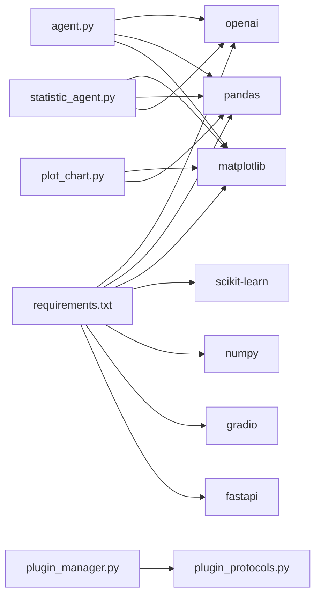

# 代理系统核心

<cite>
**本文档引用的文件**
- [agent.py](file://agent.py)
- [statistic_agent.py](file://statistic_agent.py)
- [main.py](file://main.py)
- [core/plugin_manager.py](file://core/plugin_manager.py)
- [core/plugin_protocols.py](file://core/plugin_protocols.py)
- [utils/schemas.py](file://utils/schemas.py)
- [utils/memory.py](file://utils/memory.py)
- [tool/evaluator.py](file://tool/evaluator.py)
- [plot_chart.py](file://plot_chart.py)
- [requirements.txt](file://requirements.txt)
</cite>

## 目录
1. [简介](#简介)
2. [项目结构](#项目结构)
3. [核心组件](#核心组件)
4. [架构总览](#架构总览)
5. [详细组件分析](#详细组件分析)
6. [依赖分析](#依赖分析)
7. [性能考虑](#性能考虑)
8. [故障排查指南](#故障排查指南)
9. [结论](#结论)
10. [附录](#附录)

## 简介
本文件面向DeepStatic项目的代理系统，系统性阐述智能代理的工作原理与实现，包括：
- 多步骤推理机制与动态动作选择算法
- 知识管理与上下文维护
- 通用研究Agent的主循环与Schema动态构造
- Statistical Agent的Plan-Confirm-Execute-Report四阶段流程
- 代理系统的评价与自我修正机制
- 性能优化技巧与最佳实践
- 扩展与定制指南

## 项目结构
项目采用“核心代理 + 工具与插件 + 工具链”的分层架构：
- 代理层：通用研究Agent与统计分析Agent
- 工具层：搜索、重写、聚类、去重、评估、可视化等
- 插件层：LLM、搜索等插件的统一管理与发现
- 工具链：Schema、内存、追踪、令牌预算等基础设施

**图表来源**
- [agent.py](file://agent.py)
- [statistic_agent.py](file://statistic_agent.py)
- [core/plugin_manager.py](file://core/plugin_manager.py)
- [core/plugin_protocols.py](file://core/plugin_protocols.py)
- [utils/schemas.py](file://utils/schemas.py)
- [utils/memory.py](file://utils/memory.py)
- [tool/evaluator.py](file://tool/evaluator.py)
- [plot_chart.py](file://plot_chart.py)

**章节来源**
- [agent.py](file://agent.py)
- [statistic_agent.py](file://statistic_agent.py)
- [core/plugin_manager.py](file://core/plugin_manager.py)
- [core/plugin_protocols.py](file://core/plugin_protocols.py)
- [utils/schemas.py](file://utils/schemas.py)
- [utils/memory.py](file://utils/memory.py)
- [tool/evaluator.py](file://tool/evaluator.py)
- [plot_chart.py](file://plot_chart.py)

## 核心组件
- 通用研究Agent：基于多轮迭代的多步骤推理，动态构建动作Schema，结合记忆与上下文，执行搜索、阅读、反思、编码与回答。
- 统计分析Agent：遵循Plan-Confirm-Execute-Report流程，生成分析视角，执行数据抽取与可视化，生成可读性强的统计报告。
- 插件体系：统一的插件发现与实例化，屏蔽LLM/搜索等外部服务差异。
- 工具与Schema：严格的Schema驱动输出，确保动作与结果的结构化与可验证性。
- 记忆与上下文：基于Token预算的记忆压缩与整合，避免上下文膨胀。

**章节来源**
- [agent.py](file://agent.py)
- [statistic_agent.py](file://statistic_agent.py)
- [core/plugin_manager.py](file://core/plugin_manager.py)
- [core/plugin_protocols.py](file://core/plugin_protocols.py)
- [utils/schemas.py](file://utils/schemas.py)
- [utils/memory.py](file://utils/memory.py)

## 架构总览
代理系统通过“动作Schema + 上下文 + 工具链 + 插件”的组合实现：
- 动作Schema：根据当前允许的动作集合动态构造，确保每次推理输出符合结构化约束。
- 上下文：包含历史对话、知识库、URL权重、反思队列等，贯穿每轮迭代。
- 工具链：搜索、重写、聚类、评估、可视化等工具按需调用。
- 插件：统一的插件管理器负责发现、实例化与缓存，支持热更新。

**图表来源**
- [agent.py](file://agent.py)
- [utils/schemas.py](file://utils/schemas.py)
- [utils/memory.py](file://utils/memory.py)
- [core/plugin_manager.py](file://core/plugin_manager.py)
- [tool/evaluator.py](file://tool/evaluator.py)

## 详细组件分析

### 通用研究Agent：主循环与Schema动态构造
- 主循环控制流
  - 初始化上下文、预算、记忆、URL集合与反思队列
  - 每轮迭代：
    - 读取并压缩记忆，避免上下文膨胀
    - 动态构建动作Schema（根据允许动作集合）
    - 生成系统提示词与消息（包含知识库、历史对话、评审要求）
    - 调用LLM生成动作与回答
    - 执行动作（搜索/阅读/反思/编码/回答）
    - 评估回答质量（严格/新鲜度/完整性/数量）
    - 更新上下文与预算，直至满足终止条件
- 动作空间与Schema
  - 允许动作：搜索、阅读、反思、编码、回答
  - 动态Schema：根据当前轮次与允许动作，构造包含think与对应动作payload的模型
  - 动作选择：基于当前问题、URL权重、反思队列与预算约束
- 知识管理与上下文
  - 知识库：统一的KnowledgeItem列表，compose_msgs将知识前置
  - URL管理：过滤/重排序/去重，维持权重与主机多样性
  - 记忆管理：估算Token，超限时压缩为摘要条目，保留最近若干条

**图表来源**
- [agent.py](file://agent.py)
- [utils/schemas.py](file://utils/schemas.py)
- [utils/memory.py](file://utils/memory.py)
- [tool/evaluator.py](file://tool/evaluator.py)

**章节来源**
- [agent.py](file://agent.py)
- [utils/schemas.py](file://utils/schemas.py)
- [utils/memory.py](file://utils/memory.py)
- [tool/evaluator.py](file://tool/evaluator.py)

### Statistical Agent：Plan-Confirm-Execute-Report四阶段
- Plan：根据用户问题生成分析视角（think/insight/plan/need_plot/plot_title），形成可执行的步骤清单
- Confirm：将计划展示给前端，允许用户调整
- Execute：并行执行分析步骤（抽取结构化数据、可视化），支持上传数据直通落地CSV
- Report：生成包含图表的Markdown报告，自动插入图片并进行统计深度解读

**图表来源**
- [statistic_agent.py](file://statistic_agent.py)
- [plot_chart.py](file://plot_chart.py)

**章节来源**
- [statistic_agent.py](file://statistic_agent.py)
- [plot_chart.py](file://plot_chart.py)

### 插件体系：统一发现与实例化
- 插件管理器：自动扫描plugins包，导入模块触发注册，延迟实例化并缓存
- 插件协议：BasePlugin、BaseLLMPlugin、BaseSearchPlugin、BaseToolPlugin定义统一接口
- 使用方式：get_plugin_instance(category, name, config)获取实例，支持热更新

**图表来源**
- [core/plugin_manager.py](file://core/plugin_manager.py)
- [core/plugin_protocols.py](file://core/plugin_protocols.py)

**章节来源**
- [core/plugin_manager.py](file://core/plugin_manager.py)
- [core/plugin_protocols.py](file://core/plugin_protocols.py)

### 工具与Schema：结构化输出与动作约束
- 动作Schema动态构造：build_agent_action_payload根据允许动作生成模型，包含think与对应payload字段
- 评估Schema：definitive/freshness/plurality/completeness/strict等，统一评估维度
- 查询重写与搜索：SearchQuery/QueryRewriterSchema，支持时间过滤与地理位置
- 代码生成：CodeGeneratorSchema，约束生成可执行的Python代码

**章节来源**
- [utils/schemas.py](file://utils/schemas.py)
- [tool/evaluator.py](file://tool/evaluator.py)

### 记忆与上下文：Token预算与压缩
- 统一存放知识条目，估算Token，超限时压缩为摘要条目
- 保留最近若干条，避免丢失最新信息
- 原地维护列表，外部引用同步可见

**章节来源**
- [utils/memory.py](file://utils/memory.py)

## 依赖分析
- 外部依赖：OpenAI、Matplotlib、Pandas、Scikit-learn、NumPy、Gradio、FastAPI等
- 关键依赖关系：
  - 代理依赖工具链与插件，工具链依赖Schema与追踪
  - 统计Agent依赖可视化与代码沙盒，二者依赖工具链
  - 插件管理器依赖协议定义，协议定义抽象接口

**图表来源**
- [requirements.txt](file://requirements.txt)
- [agent.py](file://agent.py)
- [statistic_agent.py](file://statistic_agent.py)
- [plot_chart.py](file://plot_chart.py)
- [core/plugin_manager.py](file://core/plugin_manager.py)
- [core/plugin_protocols.py](file://core/plugin_protocols.py)

**章节来源**
- [requirements.txt](file://requirements.txt)

## 性能考虑
- 并发与限流
  - 搜索并发：使用asyncio.gather并按STEP_SLEEP间隔控制速率
  - 代理团队并发：Semaphore限制AnalystAgent并行数，避免LLM服务过载
- Token预算与上下文控制
  - 记忆压缩：超限时将早期知识压缩为摘要，保留最近若干条
  - 动态动作Schema：减少不必要的字段，降低输出体积
- URL管理与多样性
  - 过滤/重排序/去重，限制每主机最多保留Top-K，提升覆盖率与多样性
- 评估与自我修正
  - 多维度评估（严格/新鲜度/完整性/数量），失败时生成改进计划
  - 通过反思队列与澄清问题，逐步缩小知识缺口

**章节来源**
- [agent.py](file://agent.py)
- [statistic_agent.py](file://statistic_agent.py)
- [utils/memory.py](file://utils/memory.py)
- [tool/evaluator.py](file://tool/evaluator.py)

## 故障排查指南
- 评估失败
  - 现象：评估返回pass=false，附带think与改进计划
  - 排查：检查回答是否满足definitive/freshness/completeness/plurality要求；核对知识库引用与时间戳
- 搜索失败
  - 现象：搜索插件返回空结果或401
  - 排查：检查SEARCH_PROVIDER与API密钥；确认域名白名单/黑名单与host限制
- 记忆压缩异常
  - 现象：压缩失败或摘要生成失败
  - 排查：检查LLM可用性与Token追踪；适当降低摘要输入长度
- 并发超载
  - 现象：代理/分析器响应慢或失败
  - 排查：降低team_size或STEP_SLEEP；检查外部服务限流

**章节来源**
- [tool/evaluator.py](file://tool/evaluator.py)
- [agent.py](file://agent.py)
- [utils/memory.py](file://utils/memory.py)

## 结论
DeepStatic的代理系统通过“动作Schema + 上下文 + 工具链 + 插件”的组合，实现了可扩展、可评估、可自我修正的研究与统计分析流程。通用研究Agent强调多步骤推理与知识整合，统计Agent强调结构化视角与可视化报告。配合严格的Schema与评估体系，系统在准确性、一致性与可解释性方面具备良好表现。

## 附录

### 代码示例路径（用于理解实现）
- 通用研究Agent主循环与动作选择
  - [agent.py](file://agent.py)
- 动态动作Schema构造
  - [utils/schemas.py](file://utils/schemas.py)
- 记忆压缩与上下文控制
  - [utils/memory.py](file://utils/memory.py)
- 评估维度与自我修正
  - [tool/evaluator.py](file://tool/evaluator.py)
- 统计Agent四阶段流程
  - [statistic_agent.py](file://statistic_agent.py)
- 可视化与报告生成
  - [plot_chart.py](file://plot_chart.py)
- 插件管理与协议
  - [core/plugin_manager.py](file://core/plugin_manager.py)
  - [core/plugin_protocols.py](file://core/plugin_protocols.py)
- 依赖声明
  - [requirements.txt](file://requirements.txt)