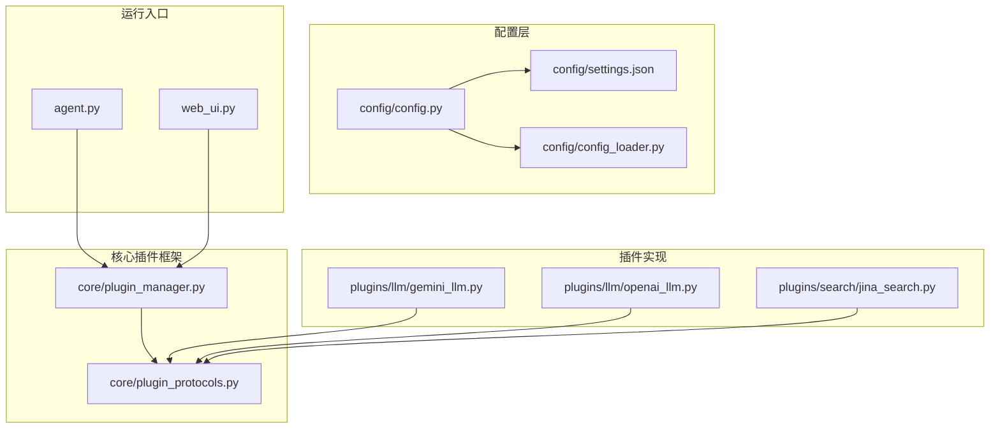
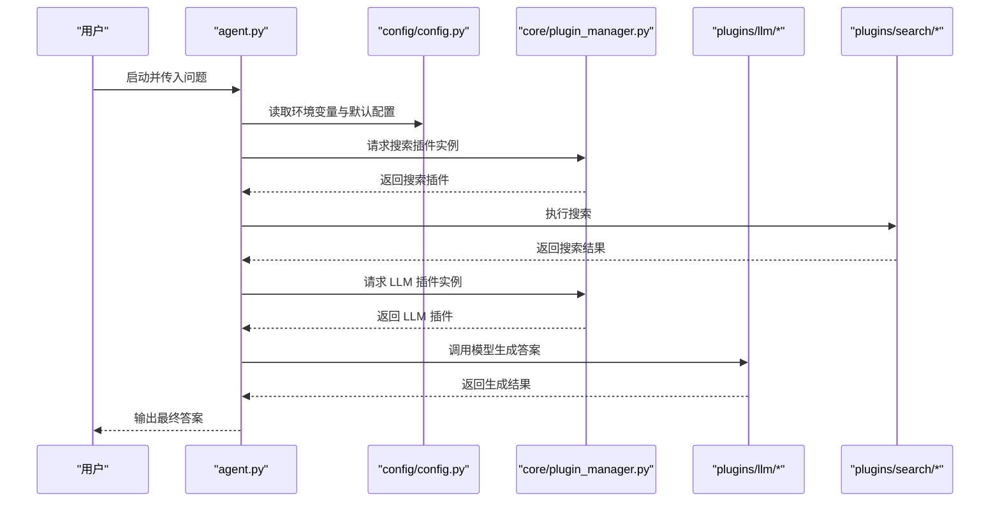
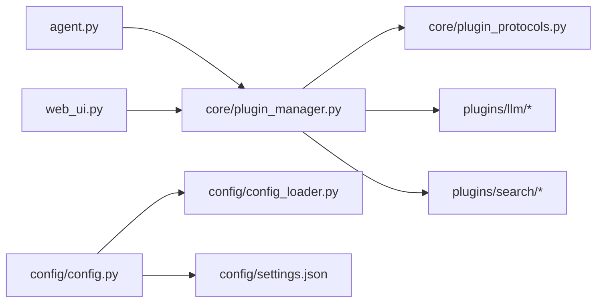

# 安装与配置

<cite>
**本文引用的文件**   
- [requirements.txt](file://requirements.txt)
- [env_example.txt](file://env_example.txt)
- [config/settings.json](file://config/settings.json)
- [config/config.py](file://config/config.py)
- [config/config_loader.py](file://config/config_loader.py)
- [core/plugin_protocols.py](file://core/plugin_protocols.py)
- [core/plugin_manager.py](file://core/plugin_manager.py)
- [PLUGINS_GUIDE.md](file://PLUGINS_GUIDE.md)
- [plugins/llm/gemini_llm.py](file://plugins/llm/gemini_llm.py)
- [plugins/llm/openai_llm.py](file://plugins/llm/openai_llm.py)
- [plugins/search/jina_search.py](file://plugins/search/jina_search.py)
- [agent.py](file://agent.py)
- [web_ui.py](file://web_ui.py)
</cite>

## 目录
1. [简介](#简介)
2. [项目结构](#项目结构)
3. [核心组件](#核心组件)
4. [架构总览](#架构总览)
5. [详细组件分析](#详细组件分析)
6. [依赖关系分析](#依赖关系分析)
7. [性能注意事项](#性能注意事项)
8. [故障排查指南](#故障排查指南)
9. [结论](#结论)
10. [附录](#附录)

## 简介
本指南面向首次接触 DeepStatic 的用户，帮助你在不同操作系统上完成环境准备、依赖安装、配置文件与环境变量设置，并完成数据库与模型提供商的对接。文档同时提供常见问题排查建议与跨平台安装命令示例，确保你能快速完成环境搭建并顺利运行。

## 项目结构
DeepStatic 采用模块化设计，核心配置位于 config 目录，插件体系通过 core 下的协议与管理器实现扩展，LLM 与搜索插件分别位于 plugins/llm 与 plugins/search。运行入口包括命令行与 Web UI。

图示来源
- [config/config.py:1-155](file://config/config.py#L1-L155)
- [config/config_loader.py:1-8](file://config/config_loader.py#L1-L8)
- [core/plugin_protocols.py:1-99](file://core/plugin_protocols.py#L1-L99)
- [core/plugin_manager.py:1-121](file://core/plugin_manager.py#L1-L121)
- [plugins/llm/gemini_llm.py:1-52](file://plugins/llm/gemini_llm.py#L1-L52)
- [plugins/llm/openai_llm.py:1-59](file://plugins/llm/openai_llm.py#L1-L59)
- [plugins/search/jina_search.py:1-71](file://plugins/search/jina_search.py#L1-L71)
- [agent.py:1-120](file://agent.py#L1-L120)
- [web_ui.py](file://web_ui.py)

章节来源
- [config/config.py:1-155](file://config/config.py#L1-L155)
- [core/plugin_protocols.py:1-99](file://core/plugin_protocols.py#L1-L99)
- [core/plugin_manager.py:1-121](file://core/plugin_manager.py#L1-L121)

## 核心组件
- 配置加载器：从 settings.json 读取只读配置，供全局使用。
- 配置解析器：从 .env 文件加载环境变量，结合 settings.json 合并为运行时配置。
- 插件协议：定义 LLM 与搜索插件的统一接口。
- 插件管理器：自动发现并实例化插件，支持热重载。
- LLM 插件：封装 Gemini 与 OpenAI（兼容 OpenAI 协议）客户端与模型配置。
- 搜索插件：封装 Jina 搜索，支持通用与 arXiv 域搜索。

章节来源
- [config/config_loader.py:1-8](file://config/config_loader.py#L1-L8)
- [config/config.py:1-155](file://config/config.py#L1-L155)
- [core/plugin_protocols.py:1-99](file://core/plugin_protocols.py#L1-L99)
- [core/plugin_manager.py:1-121](file://core/plugin_manager.py#L1-L121)
- [plugins/llm/gemini_llm.py:1-52](file://plugins/llm/gemini_llm.py#L1-L52)
- [plugins/llm/openai_llm.py:1-59](file://plugins/llm/openai_llm.py#L1-L59)
- [plugins/search/jina_search.py:1-71](file://plugins/search/jina_search.py#L1-L71)

## 架构总览
DeepStatic 的运行时由“配置层 + 插件层 + 应用层”构成。配置层负责读取 settings.json 与 .env；插件层通过协议与管理器实现 LLM 与搜索能力的可插拔；应用层（命令行 agent.py 与 Web UI）基于插件完成搜索与生成任务。

图示来源
- [agent.py:329-480](file://agent.py#L329-L480)
- [config/config.py:1-155](file://config/config.py#L1-L155)
- [core/plugin_manager.py:54-84](file://core/plugin_manager.py#L54-L84)
- [plugins/llm/gemini_llm.py:15-52](file://plugins/llm/gemini_llm.py#L15-L52)
- [plugins/llm/openai_llm.py:18-59](file://plugins/llm/openai_llm.py#L18-L59)
- [plugins/search/jina_search.py:15-71](file://plugins/search/jina_search.py#L15-L71)

## 详细组件分析

### 依赖安装与环境要求
- Python 版本：项目使用较多现代库，建议使用 Python 3.10+（仓库中依赖版本范围与较新库兼容性良好）。
- 依赖安装：使用 pip 安装 requirements.txt 中列出的全部依赖。
- 建议使用虚拟环境隔离依赖，避免与系统或其他项目冲突。

章节来源
- [requirements.txt:1-111](file://requirements.txt#L1-L111)

### 环境变量配置
- 参考模板：env_example.txt 提供了 API 密钥、模型基础地址与搜索提供商的基本键名。
- 常用键：
  - API_KEY / OPENAI_API_KEY / GEMINI_API_KEY / JINA_API_KEY / BRAVE_API_KEY / SERPER_API_KEY
  - BASE_URL / OPENAI_BASE_URL
  - SEARCH_PROVIDER
  - LLM_PROVIDER / LLM_API_KEY / LLM_BASE_URL
  - STEP_SLEEP
  - HTTPS_PROXY
- 注意：config/config.py 会从 .env 加载上述键值，并与 settings.json 的 defaults/providers/models 合并生效。

章节来源
- [env_example.txt:1-3](file://env_example.txt#L1-L3)
- [config/config.py:1-155](file://config/config.py#L1-L155)

### 配置文件 settings.json 结构说明
- env：存放各类 API 密钥与代理等环境相关键值。
- defaults：默认行为配置，如默认搜索/LLM 提供商、步进睡眠时间。
- providers：各提供商的客户端创建方式与兼容性配置。
- models：按提供商划分的模型默认配置与工具级覆盖项（如温度、最大 token 数、模型名称等）。

章节来源
- [config/settings.json:1-127](file://config/settings.json#L1-L127)

### 数据库与外部服务
- 项目未内置数据库驱动或 ORM；如需持久化，可在应用层自行引入数据库驱动并在业务逻辑中使用。
- 项目通过插件访问外部服务（如 Jina 搜索、Gemini/OpenAI 生成），无需本地数据库。

章节来源
- [plugins/search/jina_search.py:1-71](file://plugins/search/jina_search.py#L1-L71)
- [plugins/llm/gemini_llm.py:1-52](file://plugins/llm/gemini_llm.py#L1-L52)
- [plugins/llm/openai_llm.py:1-59](file://plugins/llm/openai_llm.py#L1-L59)

### 模型提供商设置
- 支持的 LLM 提供商（示例）：
  - Gemini：通过 GEMINI_API_KEY 初始化客户端。
  - OpenAI：通过 OPENAI_API_KEY 与 OPENAI_BASE_URL 初始化客户端。
- LLM 插件通过 get_client 返回三元组（客户端、兼容模式、模型名），供上层调用。
- 可通过 LLM_PROVIDER/LLM_API_KEY/LLM_BASE_URL 动态切换提供商与自定义端点。

章节来源
- [plugins/llm/gemini_llm.py:15-52](file://plugins/llm/gemini_llm.py#L15-L52)
- [plugins/llm/openai_llm.py:18-59](file://plugins/llm/openai_llm.py#L18-L59)
- [config/config.py:96-155](file://config/config.py#L96-L155)

### 搜索提供商设置
- 默认搜索提供商可在 settings.json defaults 中配置，也可通过 SEARCH_PROVIDER 环境变量覆盖。
- Jina 搜索插件需要 JINA_API_KEY，支持通用搜索与 arXiv 域搜索。
- 可通过插件化机制接入更多搜索引擎（见插件指南）。

章节来源
- [config/settings.json:12-16](file://config/settings.json#L12-L16)
- [plugins/search/jina_search.py:15-71](file://plugins/search/jina_search.py#L15-L71)
- [PLUGINS_GUIDE.md:1-160](file://PLUGINS_GUIDE.md#L1-L160)

### 运行方式
- 命令行：设置环境变量后，直接运行 agent.py 并传入问题。
- Web UI：启动 web_ui.py，界面会自动读取已注册插件列表，支持在 UI 中选择提供商与模型。

章节来源
- [agent.py:1-120](file://agent.py#L1-L120)
- [web_ui.py](file://web_ui.py)

## 依赖关系分析
- 配置层依赖：
  - config/config_loader.py 读取 config/settings.json。
  - config/config.py 从 .env 加载环境变量并与配置合并。
- 插件层依赖：
  - core/plugin_protocols.py 定义插件接口。
  - core/plugin_manager.py 自动发现并实例化插件。
  - plugins/llm/* 与 plugins/search/* 实现具体提供商能力。
- 应用层依赖：
  - agent.py 与 web_ui.py 通过插件管理器获取插件实例并执行任务。

图示来源
- [agent.py:1-120](file://agent.py#L1-L120)
- [web_ui.py](file://web_ui.py)
- [core/plugin_manager.py:1-121](file://core/plugin_manager.py#L1-L121)
- [core/plugin_protocols.py:1-99](file://core/plugin_protocols.py#L1-L99)
- [config/config.py:1-155](file://config/config.py#L1-L155)
- [config/config_loader.py:1-8](file://config/config_loader.py#L1-L8)
- [config/settings.json:1-127](file://config/settings.json#L1-L127)

章节来源
- [core/plugin_manager.py:1-121](file://core/plugin_manager.py#L1-L121)
- [core/plugin_protocols.py:1-99](file://core/plugin_protocols.py#L1-L99)
- [config/config.py:1-155](file://config/config.py#L1-L155)

## 性能注意事项
- 搜索与生成的并发控制：STEP_SLEEP 可用于限制请求频率，避免触发限流。
- 模型与工具配置：通过 settings.json 的 models 节点为不同工具设置合适的 temperature 与 maxTokens，有助于控制成本与响应时间。
- 插件热重载：当 LLM_PROVIDER/LLM_API_KEY/LLM_BASE_URL 发生变化时，插件管理器会缓存并重建实例，确保配置变更即时生效。

章节来源
- [config/config.py:60-94](file://config/config.py#L60-L94)
- [config/settings.json:28-125](file://config/settings.json#L28-L125)

## 故障排查指南
- 缺少 API 密钥
  - 症状：初始化 LLM 或搜索插件时报错。
  - 处理：在 .env 中补齐对应 API_KEY（如 OPENAI_API_KEY、GEMINI_API_KEY、JINA_API_KEY 等），或在 settings.json 的 env 中配置。
- 401 未授权
  - 症状：搜索插件返回 401。
  - 处理：检查 SEARCH_PROVIDER 对应的 API Key 是否正确，或在插件 initialize 中确认健康检查逻辑。
- 未找到默认模型
  - 症状：调用模型时报错。
  - 处理：在 settings.json 的 models 节点为所选 LLM 提供商配置默认模型与必要参数。
- 端点或基础地址错误
  - 症状：OpenAI 兼容端点无法连接。
  - 处理：设置 OPENAI_BASE_URL 或 LLM_BASE_URL，确保与目标服务一致。
- 插件未发现
  - 症状：无法选择某提供商。
  - 处理：确认插件文件位于 plugins/llm 或 plugins/search，并通过装饰器正确注册；重启应用以触发插件发现。

章节来源
- [plugins/llm/gemini_llm.py:19-27](file://plugins/llm/gemini_llm.py#L19-L27)
- [plugins/llm/openai_llm.py:22-29](file://plugins/llm/openai_llm.py#L22-L29)
- [plugins/search/jina_search.py:19-24](file://plugins/search/jina_search.py#L19-L24)
- [PLUGINS_GUIDE.md:74-103](file://PLUGINS_GUIDE.md#L74-L103)

## 结论
通过本指南，你可以完成 DeepStatic 的环境准备、依赖安装、配置文件与环境变量设置，并成功接入 Gemini、OpenAI 等 LLM 提供商与 Jina 等搜索提供商。遇到问题时，可依据故障排查指南快速定位并解决。建议在生产环境中配合代理与限流策略，以获得更稳定的体验。

## 附录

### 跨平台安装与配置示例
- Linux/macOS
  - 创建并激活虚拟环境
  - 安装依赖：pip install -r requirements.txt
  - 复制 env_example.txt 为 .env，填写 API Key 与基础地址
  - 运行命令行：python agent.py --question "你的问题"
  - 启动 Web UI：python web_ui.py
- Windows
  - 使用 PowerShell 创建并激活虚拟环境
  - 安装依赖：pip install -r requirements.txt
  - 复制 env_example.txt 为 .env，填写 API Key 与基础地址
  - 运行命令行：python agent.py --question "你的问题"
  - 启动 Web UI：python web_ui.py

章节来源
- [requirements.txt:1-111](file://requirements.txt#L1-L111)
- [env_example.txt:1-3](file://env_example.txt#L1-L3)
- [agent.py:1-120](file://agent.py#L1-L120)
- [web_ui.py](file://web_ui.py)