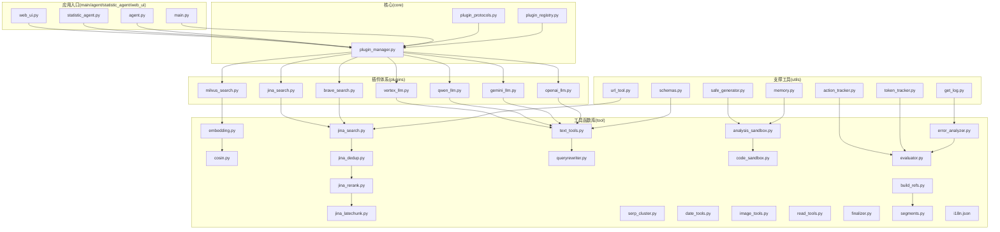
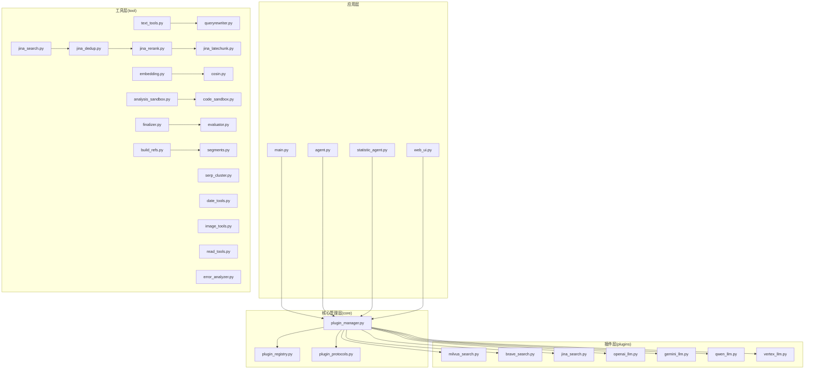
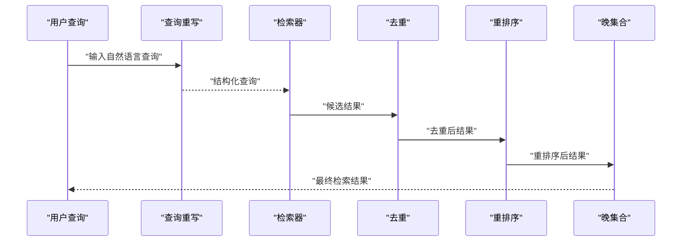
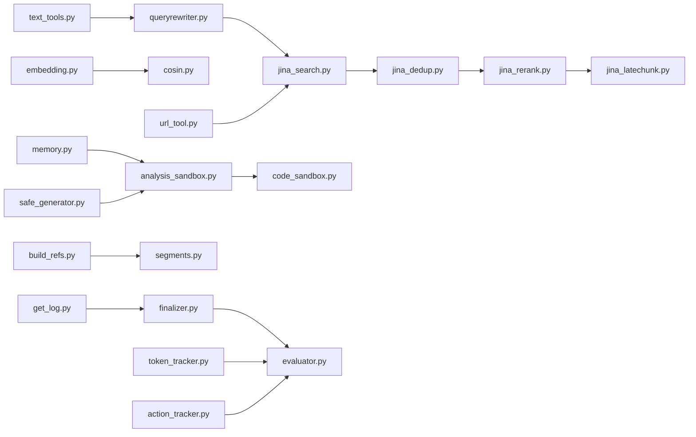

# 工具函数库

<cite>
**本文档引用的文件**
- [tool/text_tools.py](file://tool/text_tools.py)
- [tool/embedding.py](file://tool/embedding.py)
- [tool/cosin.py](file://tool/cosin.py)
- [tool/jina_search.py](file://tool/jina_search.py)
- [tool/jina_dedup.py](file://tool/jina_dedup.py)
- [tool/jina_rerank.py](file://tool/jina_rerank.py)
- [tool/jina_latechunk.py](file://tool/jina_latechunk.py)
- [tool/queryrewriter.py](file://tool/queryrewriter.py)
- [tool/serp_cluster.py](file://tool/serp_cluster.py)
- [tool/date_tools.py](file://tool/date_tools.py)
- [tool/image_tools.py](file://tool/image_tools.py)
- [tool/read_tools.py](file://tool/read_tools.py)
- [tool/analysis_sandbox.py](file://tool/analysis_sandbox.py)
- [tool/code_sandbox.py](file://tool/code_sandbox.py)
- [tool/error_analyzer.py](file://tool/error_analyzer.py)
- [tool/evaluator.py](file://tool/evaluator.py)
- [tool/finalizer.py](file://tool/finalizer.py)
- [tool/build_refs.py](file://tool/build_refs.py)
- [tool/segments.py](file://tool/segments.py)
- [tool/i18n.json](file://tool/i18n.json)
- [utils/schemas.py](file://utils/schemas.py)
- [utils/url_tool.py](file://utils/url_tool.py)
- [utils/memory.py](file://utils/memory.py)
- [utils/token_tracker.py](file://utils/token_tracker.py)
- [utils/action_tracker.py](file://utils/action_tracker.py)
- [utils/get_log.py](file://utils/get_log.py)
- [utils/safe_generator.py](file://utils/safe_generator.py)
- [plugins/search/milvus_search.py](file://plugins/search/milvus_search.py)
- [plugins/search/brave_search.py](file://plugins/search/brave_search.py)
- [plugins/search/jina_search.py](file://plugins/search/jina_search.py)
- [plugins/llm/openai_llm.py](file://plugins/llm/openai_llm.py)
- [plugins/llm/gemini_llm.py](file://plugins/llm/gemini_llm.py)
- [plugins/llm/qwen_llm.py](file://plugins/llm/qwen_llm.py)
- [plugins/llm/vertex_llm.py](file://plugins/llm/vertex_llm.py)
- [core/plugin_manager.py](file://core/plugin_manager.py)
- [core/plugin_registry.py](file://core/plugin_registry.py)
- [core/plugin_protocols.py](file://core/plugin_protocols.py)
- [main.py](file://main.py)
- [agent.py](file://agent.py)
- [statistic_agent.py](file://statistic_agent.py)
- [web_ui.py](file://web_ui.py)
</cite>

## 目录
1. [简介](#简介)
2. [项目结构](#项目结构)
3. [核心组件](#核心组件)
4. [架构总览](#架构总览)
5. [详细组件分析](#详细组件分析)
6. [依赖关系分析](#依赖关系分析)
7. [性能考虑](#性能考虑)
8. [故障排除指南](#故障排除指南)
9. [结论](#结论)
10. [附录](#附录)

## 简介
本文件系统性梳理DeepStatic项目中的工具函数库，覆盖文本处理、搜索优化、嵌入计算、数据分析、安全沙箱、错误分析与评估、结果后处理等模块。文档从设计目标、核心算法、实现要点、使用示例、依赖关系、性能优化、扩展定制、测试验证等方面进行深入解析，并明确各工具在整体系统架构中的定位与协作方式。

## 项目结构
工具函数库主要位于tool目录，围绕以下主题组织：
- 文本处理：分词、清洗、重写、聚类、去重、重排序、晚集合等
- 搜索优化：查询重写、检索器集成、向量检索
- 嵌入计算：余弦相似度、嵌入生成
- 数据分析：日期工具、图像工具、阅读理解辅助
- 安全沙箱：代码与分析执行隔离
- 质量评估：错误分析、指标评估、最终化输出
- 结果构建：引用构建、段落切分
- 多语言支持：国际化资源
- 工具支撑：URL工具、内存管理、令牌追踪、动作追踪、日志获取、安全生成器
- 插件体系：搜索插件、LLM插件、插件注册与管理

**图表来源**
- [tool/text_tools.py](file://tool/text_tools.py)
- [tool/embedding.py](file://tool/embedding.py)
- [tool/cosin.py](file://tool/cosin.py)
- [tool/jina_search.py](file://tool/jina_search.py)
- [tool/jina_dedup.py](file://tool/jina_dedup.py)
- [tool/jina_rerank.py](file://tool/jina_rerank.py)
- [tool/jina_latechunk.py](file://tool/jina_latechunk.py)
- [tool/queryrewriter.py](file://tool/queryrewriter.py)
- [tool/serp_cluster.py](file://tool/serp_cluster.py)
- [tool/date_tools.py](file://tool/date_tools.py)
- [tool/image_tools.py](file://tool/image_tools.py)
- [tool/read_tools.py](file://tool/read_tools.py)
- [tool/analysis_sandbox.py](file://tool/analysis_sandbox.py)
- [tool/code_sandbox.py](file://tool/code_sandbox.py)
- [tool/error_analyzer.py](file://tool/error_analyzer.py)
- [tool/evaluator.py](file://tool/evaluator.py)
- [tool/finalizer.py](file://tool/finalizer.py)
- [tool/build_refs.py](file://tool/build_refs.py)
- [tool/segments.py](file://tool/segments.py)
- [utils/schemas.py](file://utils/schemas.py)
- [utils/url_tool.py](file://utils/url_tool.py)
- [utils/memory.py](file://utils/memory.py)
- [utils/token_tracker.py](file://utils/token_tracker.py)
- [utils/action_tracker.py](file://utils/action_tracker.py)
- [utils/get_log.py](file://utils/get_log.py)
- [utils/safe_generator.py](file://utils/safe_generator.py)
- [plugins/search/milvus_search.py](file://plugins/search/milvus_search.py)
- [plugins/search/brave_search.py](file://plugins/search/brave_search.py)
- [plugins/search/jina_search.py](file://plugins/search/jina_search.py)
- [plugins/llm/openai_llm.py](file://plugins/llm/openai_llm.py)
- [plugins/llm/gemini_llm.py](file://plugins/llm/gemini_llm.py)
- [plugins/llm/qwen_llm.py](file://plugins/llm/qwen_llm.py)
- [plugins/llm/vertex_llm.py](file://plugins/llm/vertex_llm.py)
- [core/plugin_manager.py](file://core/plugin_manager.py)
- [core/plugin_registry.py](file://core/plugin_registry.py)
- [core/plugin_protocols.py](file://core/plugin_protocols.py)
- [main.py](file://main.py)
- [agent.py](file://agent.py)
- [statistic_agent.py](file://statistic_agent.py)
- [web_ui.py](file://web_ui.py)

**章节来源**
- [tool/text_tools.py](file://tool/text_tools.py)
- [tool/embedding.py](file://tool/embedding.py)
- [tool/cosin.py](file://tool/cosin.py)
- [tool/jina_search.py](file://tool/jina_search.py)
- [tool/jina_dedup.py](file://tool/jina_dedup.py)
- [tool/jina_rerank.py](file://tool/jina_rerank.py)
- [tool/jina_latechunk.py](file://tool/jina_latechunk.py)
- [tool/queryrewriter.py](file://tool/queryrewriter.py)
- [tool/serp_cluster.py](file://tool/serp_cluster.py)
- [tool/date_tools.py](file://tool/date_tools.py)
- [tool/image_tools.py](file://tool/image_tools.py)
- [tool/read_tools.py](file://tool/read_tools.py)
- [tool/analysis_sandbox.py](file://tool/analysis_sandbox.py)
- [tool/code_sandbox.py](file://tool/code_sandbox.py)
- [tool/error_analyzer.py](file://tool/error_analyzer.py)
- [tool/evaluator.py](file://tool/evaluator.py)
- [tool/finalizer.py](file://tool/finalizer.py)
- [tool/build_refs.py](file://tool/build_refs.py)
- [tool/segments.py](file://tool/segments.py)
- [tool/i18n.json](file://tool/i18n.json)
- [utils/schemas.py](file://utils/schemas.py)
- [utils/url_tool.py](file://utils/url_tool.py)
- [utils/memory.py](file://utils/memory.py)
- [utils/token_tracker.py](file://utils/token_tracker.py)
- [utils/action_tracker.py](file://utils/action_tracker.py)
- [utils/get_log.py](file://utils/get_log.py)
- [utils/safe_generator.py](file://utils/safe_generator.py)
- [plugins/search/milvus_search.py](file://plugins/search/milvus_search.py)
- [plugins/search/brave_search.py](file://plugins/search/brave_search.py)
- [plugins/search/jina_search.py](file://plugins/search/jina_search.py)
- [plugins/llm/openai_llm.py](file://plugins/llm/openai_llm.py)
- [plugins/llm/gemini_llm.py](file://plugins/llm/gemini_llm.py)
- [plugins/llm/qwen_llm.py](file://plugins/llm/qwen_llm.py)
- [plugins/llm/vertex_llm.py](file://plugins/llm/vertex_llm.py)
- [core/plugin_manager.py](file://core/plugin_manager.py)
- [core/plugin_registry.py](file://core/plugin_registry.py)
- [core/plugin_protocols.py](file://core/plugin_protocols.py)
- [main.py](file://main.py)
- [agent.py](file://agent.py)
- [statistic_agent.py](file://statistic_agent.py)
- [web_ui.py](file://web_ui.py)

## 核心组件
- 文本处理工具：提供查询重写、分词、清洗、聚类、去重、重排序、晚集合等功能，支撑高质量检索与下游任务。
- 搜索优化工具：集成多种搜索引擎（Brave、Jina、Milvus），统一检索接口，支持向量化检索与结果优化。
- 嵌入计算工具：提供向量嵌入生成与余弦相似度计算，用于语义匹配与聚类。
- 数据分析工具：日期处理、图像处理、阅读理解辅助，服务于多模态与信息抽取场景。
- 安全沙箱：隔离执行分析与代码，保障运行安全与稳定性。
- 质量评估工具：错误分析、指标评估、最终化输出，确保结果质量与可解释性。
- 结果构建工具：引用构建、段落切分，提升报告与知识库的可读性与可追溯性。
- 国际化与支撑：多语言资源与通用工具（URL、内存、令牌、动作、日志、安全生成器）。

**章节来源**
- [tool/text_tools.py](file://tool/text_tools.py)
- [tool/jina_search.py](file://tool/jina_search.py)
- [tool/embedding.py](file://tool/embedding.py)
- [tool/cosin.py](file://tool/cosin.py)
- [tool/analysis_sandbox.py](file://tool/analysis_sandbox.py)
- [tool/code_sandbox.py](file://tool/code_sandbox.py)
- [tool/error_analyzer.py](file://tool/error_analyzer.py)
- [tool/evaluator.py](file://tool/evaluator.py)
- [tool/finalizer.py](file://tool/finalizer.py)
- [tool/build_refs.py](file://tool/build_refs.py)
- [tool/segments.py](file://tool/segments.py)
- [tool/i18n.json](file://tool/i18n.json)
- [utils/url_tool.py](file://utils/url_tool.py)
- [utils/memory.py](file://utils/memory.py)
- [utils/token_tracker.py](file://utils/token_tracker.py)
- [utils/action_tracker.py](file://utils/action_tracker.py)
- [utils/get_log.py](file://utils/get_log.py)
- [utils/safe_generator.py](file://utils/safe_generator.py)

## 架构总览
工具函数库通过插件体系与核心管理器解耦，形成“工具层-插件层-核心管理层”的三层架构。工具层提供具体功能；插件层封装外部服务或第三方能力；核心管理层负责插件注册、加载与调度。

**图表来源**
- [core/plugin_manager.py](file://core/plugin_manager.py)
- [core/plugin_registry.py](file://core/plugin_registry.py)
- [core/plugin_protocols.py](file://core/plugin_protocols.py)
- [plugins/search/milvus_search.py](file://plugins/search/milvus_search.py)
- [plugins/search/brave_search.py](file://plugins/search/brave_search.py)
- [plugins/search/jina_search.py](file://plugins/search/jina_search.py)
- [plugins/llm/openai_llm.py](file://plugins/llm/openai_llm.py)
- [plugins/llm/gemini_llm.py](file://plugins/llm/gemini_llm.py)
- [plugins/llm/qwen_llm.py](file://plugins/llm/qwen_llm.py)
- [plugins/llm/vertex_llm.py](file://plugins/llm/vertex_llm.py)
- [tool/text_tools.py](file://tool/text_tools.py)
- [tool/embedding.py](file://tool/embedding.py)
- [tool/cosin.py](file://tool/cosin.py)
- [tool/jina_search.py](file://tool/jina_search.py)
- [tool/jina_dedup.py](file://tool/jina_dedup.py)
- [tool/jina_rerank.py](file://tool/jina_rerank.py)
- [tool/jina_latechunk.py](file://tool/jina_latechunk.py)
- [tool/queryrewriter.py](file://tool/queryrewriter.py)
- [tool/serp_cluster.py](file://tool/serp_cluster.py)
- [tool/date_tools.py](file://tool/date_tools.py)
- [tool/image_tools.py](file://tool/image_tools.py)
- [tool/read_tools.py](file://tool/read_tools.py)
- [tool/analysis_sandbox.py](file://tool/analysis_sandbox.py)
- [tool/code_sandbox.py](file://tool/code_sandbox.py)
- [tool/error_analyzer.py](file://tool/error_analyzer.py)
- [tool/evaluator.py](file://tool/evaluator.py)
- [tool/finalizer.py](file://tool/finalizer.py)
- [tool/build_refs.py](file://tool/build_refs.py)
- [tool/segments.py](file://tool/segments.py)

## 详细组件分析

### 文本处理工具(text_tools.py)
- 设计目的：提供文本清洗、分词、规范化、查询增强等基础能力，支撑后续检索与分析流程。
- 核心算法与实现要点：
  - 文本清洗与标准化（去除噪声、统一格式）
  - 分词与词干提取（基于规则或模型）
  - 查询增强与关键词抽取（提升检索召回）
- 使用示例与代码片段路径：
  - [text_tools.py](file://tool/text_tools.py)
- 组合使用方法：
  - 与查询重写工具配合，先清洗再重写，提高检索质量
- 性能优化建议：
  - 批量处理时合并调用，减少重复初始化
  - 缓存常用分词与清洗规则
- 注意事项：
  - 避免对长文本进行过度清洗导致语义丢失
  - 多语言文本需选择合适的分词策略

**章节来源**
- [tool/text_tools.py](file://tool/text_tools.py)

### 查询重写工具(queryrewriter.py)
- 设计目的：将用户自然语言查询转换为更利于检索的结构化查询，提升召回与相关性。
- 核心算法与实现要点：
  - 关键词提取与意图识别
  - 查询扩展与布尔表达式构造
  - 与LLM插件结合进行智能改写
- 使用示例与代码片段路径：
  - [queryrewriter.py](file://tool/queryrewriter.py)
  - [plugins/llm/openai_llm.py](file://plugins/llm/openai_llm.py)
  - [plugins/llm/gemini_llm.py](file://plugins/llm/gemini_llm.py)
  - [plugins/llm/qwen_llm.py](file://plugins/llm/qwen_llm.py)
  - [plugins/llm/vertex_llm.py](file://plugins/llm/vertex_llm.py)
- 组合使用方法：
  - 先经文本清洗，再进行查询重写，最后交由检索器执行
- 性能优化建议：
  - 对常见查询模式建立缓存
  - 控制重写复杂度，避免过度扩展
- 注意事项：
  - 避免引入歧义或无关信息
  - 保持原查询意图不变

**章节来源**
- [tool/queryrewriter.py](file://tool/queryrewriter.py)
- [plugins/llm/openai_llm.py](file://plugins/llm/openai_llm.py)
- [plugins/llm/gemini_llm.py](file://plugins/llm/gemini_llm.py)
- [plugins/llm/qwen_llm.py](file://plugins/llm/qwen_llm.py)
- [plugins/llm/vertex_llm.py](file://plugins/llm/vertex_llm.py)

### 搜索优化工具（jina_search.py、jina_dedup.py、jina_rerank.py、jina_latechunk.py）
- 设计目的：端到端优化搜索流程，从检索到去重、重排序、晚集合，提升结果质量与多样性。
- 核心算法与实现要点：
  - 检索：统一接口对接多个搜索引擎（Brave、Jina、Milvus）
  - 去重：基于内容指纹或语义相似度去重
  - 重排序：基于相关性、时效性、权威度等特征排序
  - 晚集合：融合多路检索结果，平衡覆盖率与准确性
- 使用示例与代码片段路径：
  - [tool/jina_search.py](file://tool/jina_search.py)
  - [tool/jina_dedup.py](file://tool/jina_dedup.py)
  - [tool/jina_rerank.py](file://tool/jina_rerank.py)
  - [tool/jina_latechunk.py](file://tool/jina_latechunk.py)
  - [plugins/search/brave_search.py](file://plugins/search/brave_search.py)
  - [plugins/search/jina_search.py](file://plugins/search/jina_search.py)
  - [plugins/search/milvus_search.py](file://plugins/search/milvus_search.py)
- 组合使用方法：
  - 检索→去重→重排序→晚集合→结果输出
- 性能优化建议：
  - 并行执行多路检索，异步聚合结果
  - 合理设置去重阈值与重排序权重
- 注意事项：
  - 不同搜索引擎返回字段需统一封装
  - 晚集合参数需根据业务场景调优

**图表来源**
- [tool/queryrewriter.py](file://tool/queryrewriter.py)
- [tool/jina_search.py](file://tool/jina_search.py)
- [tool/jina_dedup.py](file://tool/jina_dedup.py)
- [tool/jina_rerank.py](file://tool/jina_rerank.py)
- [tool/jina_latechunk.py](file://tool/jina_latechunk.py)
- [plugins/search/brave_search.py](file://plugins/search/brave_search.py)
- [plugins/search/jina_search.py](file://plugins/search/jina_search.py)
- [plugins/search/milvus_search.py](file://plugins/search/milvus_search.py)

**章节来源**
- [tool/jina_search.py](file://tool/jina_search.py)
- [tool/jina_dedup.py](file://tool/jina_dedup.py)
- [tool/jina_rerank.py](file://tool/jina_rerank.py)
- [tool/jina_latechunk.py](file://tool/jina_latechunk.py)
- [plugins/search/brave_search.py](file://plugins/search/brave_search.py)
- [plugins/search/jina_search.py](file://plugins/search/jina_search.py)
- [plugins/search/milvus_search.py](file://plugins/search/milvus_search.py)

### 嵌入计算工具(embedding.py、cosin.py)
- 设计目的：提供向量嵌入生成与相似度计算，支撑语义检索与聚类。
- 核心算法与实现要点：
  - 嵌入生成：文本→向量（支持批量与流式）
  - 相似度计算：余弦相似度、内积等
- 使用示例与代码片段路径：
  - [tool/embedding.py](file://tool/embedding.py)
  - [tool/cosin.py](file://tool/cosin.py)
- 组合使用方法：
  - 文本预处理→嵌入生成→相似度计算→聚类/检索
- 性能优化建议：
  - 向量化批处理，GPU/CPU混合加速
  - 缓存常用向量，避免重复计算
- 注意事项：
  - 嵌入维度与模型需匹配业务需求
  - 相似度阈值需结合数据分布调优

**章节来源**
- [tool/embedding.py](file://tool/embedding.py)
- [tool/cosin.py](file://tool/cosin.py)

### 数据分析工具（date_tools.py、image_tools.py、read_tools.py）
- 设计目的：提供日期处理、图像处理、阅读理解辅助，支撑多模态与信息抽取。
- 核心算法与实现要点：
  - 日期解析与格式化
  - 图像元数据提取与简单处理
  - 阅读理解辅助（如摘要、关键句抽取）
- 使用示例与代码片段路径：
  - [tool/date_tools.py](file://tool/date_tools.py)
  - [tool/image_tools.py](file://tool/image_tools.py)
  - [tool/read_tools.py](file://tool/read_tools.py)
- 组合使用方法：
  - 结合文本与图像信息，进行多模态分析
- 性能优化建议：
  - 图像处理采用流式或分块策略
  - 日期解析使用本地化配置
- 注意事项：
  - 图像处理需注意隐私与版权
  - 阅读理解需结合领域知识

**章节来源**
- [tool/date_tools.py](file://tool/date_tools.py)
- [tool/image_tools.py](file://tool/image_tools.py)
- [tool/read_tools.py](file://tool/read_tools.py)

### 安全沙箱（analysis_sandbox.py、code_sandbox.py）
- 设计目的：隔离执行分析与代码，防止恶意输入与资源滥用。
- 核心算法与实现要点：
  - 进程/容器隔离
  - 资源限制（CPU、内存、时间）
  - 白名单与权限控制
- 使用示例与代码片段路径：
  - [tool/analysis_sandbox.py](file://tool/analysis_sandbox.py)
  - [tool/code_sandbox.py](file://tool/code_sandbox.py)
- 组合使用方法：
  - 在高风险分析前启用沙箱
- 性能优化建议：
  - 合理设置超时与资源配额
  - 复用沙箱实例以降低启动开销
- 注意事项：
  - 沙箱逃逸风险需持续监控
  - 日志审计不可缺失

**章节来源**
- [tool/analysis_sandbox.py](file://tool/analysis_sandbox.py)
- [tool/code_sandbox.py](file://tool/code_sandbox.py)

### 质量评估与后处理（error_analyzer.py、evaluator.py、finalizer.py）
- 设计目的：评估结果质量、分析错误、最终化输出，确保可解释性与可靠性。
- 核心算法与实现要点：
  - 错误分类与根因分析
  - 指标计算（准确率、召回率、F1等）
  - 输出规范化与可视化准备
- 使用示例与代码片段路径：
  - [tool/error_analyzer.py](file://tool/error_analyzer.py)
  - [tool/evaluator.py](file://tool/evaluator.py)
  - [tool/finalizer.py](file://tool/finalizer.py)
- 组合使用方法：
  - 评估→错误分析→修正→最终化
- 性能优化建议：
  - 指标计算批量化
  - 缓存评估中间结果
- 注意事项：
  - 评估指标需与业务目标一致
  - 错误分析需保留上下文信息

**章节来源**
- [tool/error_analyzer.py](file://tool/error_analyzer.py)
- [tool/evaluator.py](file://tool/evaluator.py)
- [tool/finalizer.py](file://tool/finalizer.py)

### 结果构建（build_refs.py、segments.py）
- 设计目的：构建引用与段落切分，提升报告与知识库的可读性与可追溯性。
- 核心算法与实现要点：
  - 引用格式化与去重
  - 段落边界检测与切分
- 使用示例与代码片段路径：
  - [tool/build_refs.py](file://tool/build_refs.py)
  - [tool/segments.py](file://tool/segments.py)
- 组合使用方法：
  - 检索→去重→重排序→晚集合→引用构建→段落切分
- 性能优化建议：
  - 切分算法采用滑动窗口与启发式规则
  - 引用构建使用索引加速
- 注意事项：
  - 引用完整性与一致性
  - 段落切分需保持语义连贯

**章节来源**
- [tool/build_refs.py](file://tool/build_refs.py)
- [tool/segments.py](file://tool/segments.py)

### 国际化与支撑工具（i18n.json、url_tool.py、memory.py、token_tracker.py、action_tracker.py、get_log.py、safe_generator.py）
- 设计目的：提供多语言支持与通用工具，保障系统可用性与可观测性。
- 核心算法与实现要点：
  - 多语言资源映射
  - URL解析与校验
  - 内存与令牌使用追踪
  - 动作与日志记录
  - 安全生成器（防注入）
- 使用示例与代码片段路径：
  - [tool/i18n.json](file://tool/i18n.json)
  - [utils/url_tool.py](file://utils/url_tool.py)
  - [utils/memory.py](file://utils/memory.py)
  - [utils/token_tracker.py](file://utils/token_tracker.py)
  - [utils/action_tracker.py](file://utils/action_tracker.py)
  - [utils/get_log.py](file://utils/get_log.py)
  - [utils/safe_generator.py](file://utils/safe_generator.py)
- 组合使用方法：
  - 全局配置与上下文管理
- 性能优化建议：
  - 资源池化与连接复用
  - 日志异步化
- 注意事项：
  - 国际化资源需定期更新
  - 安全生成器需严格白名单

**章节来源**
- [tool/i18n.json](file://tool/i18n.json)
- [utils/url_tool.py](file://utils/url_tool.py)
- [utils/memory.py](file://utils/memory.py)
- [utils/token_tracker.py](file://utils/token_tracker.py)
- [utils/action_tracker.py](file://utils/action_tracker.py)
- [utils/get_log.py](file://utils/get_log.py)
- [utils/safe_generator.py](file://utils/safe_generator.py)

## 依赖关系分析
- 工具层与插件层：工具函数通过插件管理器加载插件，实现松耦合扩展
- 工具层内部：文本处理→检索→去重→重排序→晚集合→结果构建形成流水线
- 支撑工具：URL、内存、令牌、动作、日志、安全生成器贯穿各模块
- 应用层：main、agent、statistic_agent、web_ui通过插件管理器驱动工具链

**图表来源**
- [tool/text_tools.py](file://tool/text_tools.py)
- [tool/queryrewriter.py](file://tool/queryrewriter.py)
- [tool/jina_search.py](file://tool/jina_search.py)
- [tool/jina_dedup.py](file://tool/jina_dedup.py)
- [tool/jina_rerank.py](file://tool/jina_rerank.py)
- [tool/jina_latechunk.py](file://tool/jina_latechunk.py)
- [tool/embedding.py](file://tool/embedding.py)
- [tool/cosin.py](file://tool/cosin.py)
- [tool/analysis_sandbox.py](file://tool/analysis_sandbox.py)
- [tool/code_sandbox.py](file://tool/code_sandbox.py)
- [tool/finalizer.py](file://tool/finalizer.py)
- [tool/evaluator.py](file://tool/evaluator.py)
- [tool/build_refs.py](file://tool/build_refs.py)
- [tool/segments.py](file://tool/segments.py)
- [utils/url_tool.py](file://utils/url_tool.py)
- [utils/memory.py](file://utils/memory.py)
- [utils/token_tracker.py](file://utils/token_tracker.py)
- [utils/action_tracker.py](file://utils/action_tracker.py)
- [utils/get_log.py](file://utils/get_log.py)
- [utils/safe_generator.py](file://utils/safe_generator.py)

**章节来源**
- [core/plugin_manager.py](file://core/plugin_manager.py)
- [core/plugin_registry.py](file://core/plugin_registry.py)
- [core/plugin_protocols.py](file://core/plugin_protocols.py)
- [plugins/search/milvus_search.py](file://plugins/search/milvus_search.py)
- [plugins/search/brave_search.py](file://plugins/search/brave_search.py)
- [plugins/search/jina_search.py](file://plugins/search/jina_search.py)
- [plugins/llm/openai_llm.py](file://plugins/llm/openai_llm.py)
- [plugins/llm/gemini_llm.py](file://plugins/llm/gemini_llm.py)
- [plugins/llm/qwen_llm.py](file://plugins/llm/qwen_llm.py)
- [plugins/llm/vertex_llm.py](file://plugins/llm/vertex_llm.py)

## 性能考虑
- 批量化与并发：对嵌入、检索、重排序等操作采用批处理与并行执行
- 缓存策略：对高频查询、分词规则、向量结果建立缓存
- 资源隔离：沙箱与资源限制避免资源争用
- 异步化：日志、评估、最终化等非关键路径异步执行
- 参数调优：晚集合、去重、重排序阈值需结合业务数据分布调优

## 故障排除指南
- 沙箱异常：检查资源配额与权限，查看日志审计
- 检索失败：核对插件配置与网络连通性，确认查询重写是否合理
- 评估偏差：检查指标定义与数据标注，复核评估流程
- 内存泄漏：监控内存使用，及时释放缓存与连接
- 国际化显示问题：检查资源文件编码与加载路径

**章节来源**
- [tool/analysis_sandbox.py](file://tool/analysis_sandbox.py)
- [tool/error_analyzer.py](file://tool/error_analyzer.py)
- [utils/get_log.py](file://utils/get_log.py)
- [utils/memory.py](file://utils/memory.py)
- [utils/token_tracker.py](file://utils/token_tracker.py)
- [utils/action_tracker.py](file://utils/action_tracker.py)

## 结论
工具函数库通过模块化设计与插件化扩展，实现了从文本处理到检索优化、从嵌入计算到结果构建的完整链路。依托沙箱与评估体系，系统在保证安全性与质量的同时，具备良好的可维护性与可扩展性。建议在实际项目中遵循本文档的使用规范与优化建议，按需组合工具模块，持续迭代参数与流程。

## 附录
- 扩展与定制指导：
  - 新增工具：遵循现有命名与接口约定，提供清晰的输入输出文档
  - 插件扩展：通过插件协议注册新插件，确保兼容性与可替换性
  - 参数化：为关键流程提供可配置参数，便于不同场景调优
- 测试与验证方法：
  - 单元测试：针对核心算法（相似度、去重、重排序）编写测试用例
  - 集成测试：模拟完整检索流程，验证端到端效果
  - A/B测试：对比不同参数或模型的效果差异
  - 回归测试：在版本升级后验证关键流程稳定性