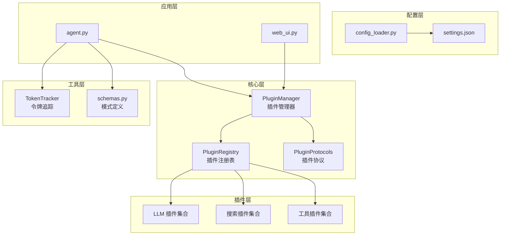
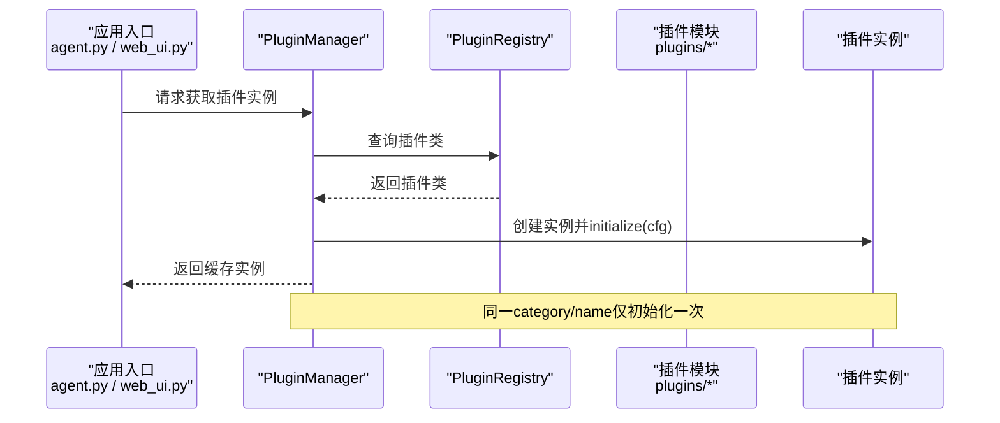
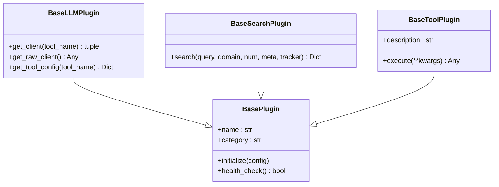
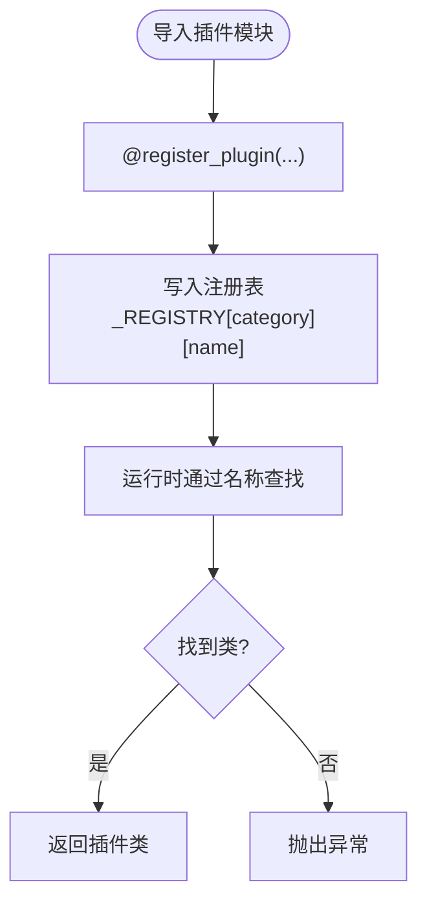
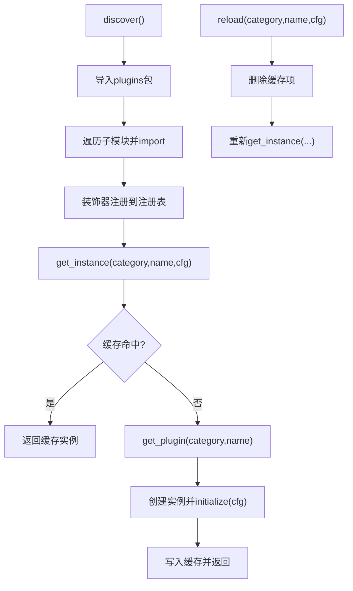
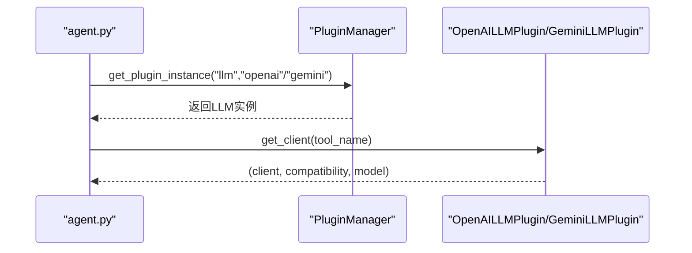
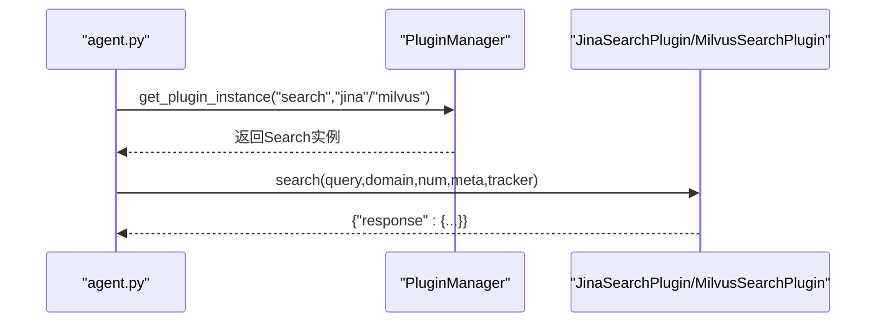
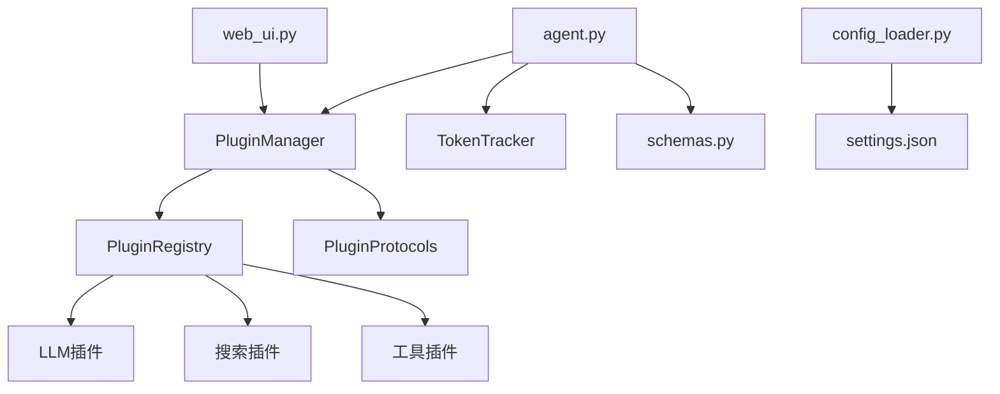

# 插件系统详解

<cite>
**本文档引用的文件**
- [core/plugin_manager.py](file://core/plugin_manager.py)
- [core/plugin_protocols.py](file://core/plugin_protocols.py)
- [core/plugin_registry.py](file://core/plugin_registry.py)
- [PLUGINS_GUIDE.md](file://PLUGINS_GUIDE.md)
- [plugins/__init__.py](file://plugins/__init__.py)
- [plugins/llm/openai_llm.py](file://plugins/llm/openai_llm.py)
- [plugins/llm/gemini_llm.py](file://plugins/llm/gemini_llm.py)
- [plugins/search/jina_search.py](file://plugins/search/jina_search.py)
- [plugins/search/milvus_search.py](file://plugins/search/milvus_search.py)
- [config/settings.json](file://config/settings.json)
- [config/config_loader.py](file://config/config_loader.py)
- [agent.py](file://agent.py)
- [web_ui.py](file://web_ui.py)
- [utils/token_tracker.py](file://utils/token_tracker.py)
- [utils/schemas.py](file://utils/schemas.py)
</cite>

## 目录
1. [简介](#简介)
2. [项目结构](#项目结构)
3. [核心组件](#核心组件)
4. [架构总览](#架构总览)
5. [详细组件分析](#详细组件分析)
6. [依赖关系分析](#依赖关系分析)
7. [性能考量](#性能考量)
8. [故障排查指南](#故障排查指南)
9. [结论](#结论)
10. [附录](#附录)

## 简介
本文件面向DeepStatic项目的插件系统，系统性阐述插件化架构的设计理念、实现原理与使用方法。内容涵盖插件协议定义、注册机制、发现与加载流程、插件管理器工作机制（含缓存、生命周期与错误处理）、插件开发指南（接口规范、实现要求、最佳实践）、扩展点与定制方法、内置插件介绍与使用示例、从入门到高级的完整教程、调试与测试方法，以及版本兼容性与升级策略。

## 项目结构
DeepStatic采用清晰的分层与模块化组织：
- 核心层：插件协议、注册表、管理器
- 插件层：按功能分类的插件实现（LLM、搜索、工具）
- 配置层：settings.json与config_loader
- 应用层：agent.py（主流程）、web_ui.py（前端界面）
- 工具层：token追踪、模式定义等

**图表来源**
- [core/plugin_manager.py:20-84](file://core/plugin_manager.py#L20-L84)
- [core/plugin_registry.py:10-68](file://core/plugin_registry.py#L10-L68)
- [core/plugin_protocols.py:9-99](file://core/plugin_protocols.py#L9-L99)
- [plugins/llm/openai_llm.py:18-59](file://plugins/llm/openai_llm.py#L18-L59)
- [plugins/search/jina_search.py:15-71](file://plugins/search/jina_search.py#L15-L71)
- [config/settings.json:1-127](file://config/settings.json#L1-L127)
- [config/config_loader.py:1-8](file://config/config_loader.py#L1-L8)
- [agent.py:34-36](file://agent.py#L34-L36)
- [web_ui.py:30-43](file://web_ui.py#L30-L43)
- [utils/token_tracker.py:44-122](file://utils/token_tracker.py#L44-L122)
- [utils/schemas.py:235-327](file://utils/schemas.py#L235-L327)

**章节来源**
- [core/plugin_manager.py:1-121](file://core/plugin_manager.py#L1-L121)
- [core/plugin_registry.py:1-69](file://core/plugin_registry.py#L1-L69)
- [core/plugin_protocols.py:1-99](file://core/plugin_protocols.py#L1-L99)
- [PLUGINS_GUIDE.md:1-160](file://PLUGINS_GUIDE.md#L1-L160)

## 核心组件
- 插件协议（BasePlugin、BaseLLMPlugin、BaseSearchPlugin、BaseToolPlugin）：定义插件的统一接口与职责边界，确保不同插件实现的一致性与可替换性。
- 插件注册表（register_plugin装饰器）：集中管理插件类映射，提供按分类与名称的查找、列表与校验能力。
- 插件管理器（PluginManager）：负责插件发现、延迟实例化、缓存与热重载，提供统一的获取接口与全局便捷函数。

**章节来源**
- [core/plugin_protocols.py:9-99](file://core/plugin_protocols.py#L9-L99)
- [core/plugin_registry.py:10-68](file://core/plugin_registry.py#L10-L68)
- [core/plugin_manager.py:20-84](file://core/plugin_manager.py#L20-L84)

## 架构总览
插件系统遵循“协议驱动 + 注册表 + 管理器”的三层架构：
- 协议层：约束插件行为，保证调用一致性
- 注册表：装饰器注册 + 运行时查找
- 管理器：自动发现 + 延迟实例化 + 缓存 + 热重载

**图表来源**
- [core/plugin_manager.py:54-83](file://core/plugin_manager.py#L54-L83)
- [core/plugin_registry.py:36-48](file://core/plugin_registry.py#L36-L48)
- [agent.py:360-364](file://agent.py#L360-L364)
- [web_ui.py:170-182](file://web_ui.py#L170-L182)

## 详细组件分析

### 插件协议体系
- BasePlugin：定义initialize与health_check的通用协议
- BaseLLMPlugin：面向大语言模型，提供客户端获取、原始客户端访问与工具配置
- BaseSearchPlugin：面向搜索，定义异步search接口与统一返回结构
- BaseToolPlugin：面向通用工具，定义execute与description

**图表来源**
- [core/plugin_protocols.py:9-99](file://core/plugin_protocols.py#L9-L99)

**章节来源**
- [core/plugin_protocols.py:9-99](file://core/plugin_protocols.py#L9-L99)

### 插件注册表与装饰器
- register_plugin(category, name)装饰器：在导入插件模块时自动注册，重复注册会抛出异常
- get_plugin(category, name)：按分类与名称获取插件类，不存在时抛出异常
- list_plugins(category)：列出已注册插件，支持按分类过滤
- has_plugin/unregister_plugin：存在性检查与注销（测试用途）

**图表来源**
- [core/plugin_registry.py:10-48](file://core/plugin_registry.py#L10-L48)

**章节来源**
- [core/plugin_registry.py:1-69](file://core/plugin_registry.py#L1-L69)
- [plugins/__init__.py:1-2](file://plugins/__init__.py#L1-L2)

### 插件管理器工作机制
- 发现：自动遍历plugins包，导入子模块触发装饰器注册
- 实例化：按需延迟创建，调用initialize注入配置
- 缓存：同category/name仅初始化一次，避免重复开销
- 热重载：reload丢弃旧实例，用新配置重建

**图表来源**
- [core/plugin_manager.py:27-83](file://core/plugin_manager.py#L27-L83)

**章节来源**
- [core/plugin_manager.py:20-121](file://core/plugin_manager.py#L20-L121)

### 内置插件详解与使用示例

#### LLM插件
- OpenAI插件：支持OpenAI兼容端点，动态合并模型配置，健康检查通过后方可使用
- Gemini插件：基于google-generativeai，支持配置注入与健康检查

**图表来源**
- [plugins/llm/openai_llm.py:18-59](file://plugins/llm/openai_llm.py#L18-L59)
- [plugins/llm/gemini_llm.py:15-52](file://plugins/llm/gemini_llm.py#L15-L52)
- [agent.py:360-364](file://agent.py#L360-L364)

**章节来源**
- [plugins/llm/openai_llm.py:18-59](file://plugins/llm/openai_llm.py#L18-L59)
- [plugins/llm/gemini_llm.py:15-52](file://plugins/llm/gemini_llm.py#L15-L52)

#### 搜索插件
- Jina插件：支持通用与arxiv域搜索，统一返回结构，集成TokenTracker
- Milvus插件：向量数据库检索，支持自定义collection与半径参数

**图表来源**
- [plugins/search/jina_search.py:15-71](file://plugins/search/jina_search.py#L15-L71)
- [plugins/search/milvus_search.py:12-72](file://plugins/search/milvus_search.py#L12-L72)
- [agent.py:360-364](file://agent.py#L360-L364)

**章节来源**
- [plugins/search/jina_search.py:15-71](file://plugins/search/jina_search.py#L15-L71)
- [plugins/search/milvus_search.py:12-72](file://plugins/search/milvus_search.py#L12-L72)

### 插件开发指南
- 选择基类：根据能力选择BaseLLMPlugin、BaseSearchPlugin或BaseToolPlugin
- 实现initialize与health_check：正确读取配置与验证可用性
- 搜索插件返回统一格式：{"response": {...}}，内部包含可解析结果列表
- LLM插件提供get_client与get_tool_config：便于上层按工具选择模型与参数
- 使用register_plugin装饰器注册，避免重复命名

参考示例与步骤详见插件接入指南。

**章节来源**
- [PLUGINS_GUIDE.md:16-160](file://PLUGINS_GUIDE.md#L16-L160)
- [core/plugin_protocols.py:29-99](file://core/plugin_protocols.py#L29-L99)
- [core/plugin_registry.py:10-33](file://core/plugin_registry.py#L10-L33)

### 扩展点与定制方法
- 配置层：settings.json提供默认provider与模型配置，config_loader一次性读取
- 运行时定制：web_ui支持前端切换provider与自定义URL/API Key，后端通过reload_plugin即时生效
- 模型配置：按工具维度覆盖默认模型参数，实现精细化控制

**章节来源**
- [config/settings.json:17-126](file://config/settings.json#L17-L126)
- [config/config_loader.py:1-8](file://config/config_loader.py#L1-L8)
- [web_ui.py:147-182](file://web_ui.py#L147-L182)

## 依赖关系分析
插件系统的关键依赖链路如下：

**图表来源**
- [core/plugin_manager.py:13-14](file://core/plugin_manager.py#L13-L14)
- [core/plugin_registry.py](file://core/plugin_registry.py#L7)
- [core/plugin_protocols.py:5-6](file://core/plugin_protocols.py#L5-L6)
- [agent.py:20-31](file://agent.py#L20-L31)
- [web_ui.py:30-31](file://web_ui.py#L30-L31)
- [utils/token_tracker.py:44-46](file://utils/token_tracker.py#L44-L46)
- [utils/schemas.py:235-242](file://utils/schemas.py#L235-L242)
- [config/config_loader.py:5-8](file://config/config_loader.py#L5-L8)

**章节来源**
- [core/plugin_manager.py:13-14](file://core/plugin_manager.py#L13-L14)
- [core/plugin_registry.py](file://core/plugin_registry.py#L7)
- [agent.py:20-31](file://agent.py#L20-L31)
- [web_ui.py:30-31](file://web_ui.py#L30-L31)
- [utils/token_tracker.py:44-46](file://utils/token_tracker.py#L44-L46)
- [utils/schemas.py:235-242](file://utils/schemas.py#L235-L242)
- [config/config_loader.py:5-8](file://config/config_loader.py#L5-L8)

## 性能考量
- 延迟实例化与缓存：避免不必要的初始化开销，提升启动与运行效率
- 并发搜索：搜索插件统一返回结构，便于上层并行处理
- Token追踪：通过TokenTracker汇总使用情况，辅助成本控制与优化
- 配置合并：按工具维度合并模型参数，减少重复配置带来的解析成本

[本节为通用指导，无需特定文件引用]

## 故障排查指南
- 插件未注册：检查装饰器是否正确使用，确认模块已被导入
- 重复注册：避免相同category/name重复注册，查看异常信息定位冲突
- 初始化失败：检查initialize中配置读取逻辑与环境变量
- 健康检查失败：确认API Key、URL等关键参数正确
- 热重载无效：确认reload_plugin调用与配置传递是否正确

**章节来源**
- [core/plugin_registry.py:24-27](file://core/plugin_registry.py#L24-L27)
- [core/plugin_manager.py:74-83](file://core/plugin_manager.py#L74-L83)
- [plugins/llm/openai_llm.py:30-36](file://plugins/llm/openai_llm.py#L30-L36)
- [plugins/search/jina_search.py:25-26](file://plugins/search/jina_search.py#L25-L26)

## 结论
DeepStatic的插件系统通过协议约束、注册表与管理器的协作，实现了高内聚、低耦合的可扩展架构。开发者可快速接入新的LLM或搜索能力，同时保持运行时的灵活性与可观测性。配合配置层与前端界面，系统在易用性与可维护性之间取得良好平衡。

[本节为总结性内容，无需特定文件引用]

## 附录

### 插件开发完整教程（从入门到高级）
- 基础概念：理解协议、注册表与管理器的作用与关系
- 快速接入：选择基类、实现initialize/health_check、使用装饰器注册
- 搜索插件：统一返回结构、集成TokenTracker、处理异常
- LLM插件：客户端获取、兼容性标记、工具配置合并
- 高级特性：热重载、按工具覆盖模型参数、前端动态切换
- 测试与调试：单元测试、日志与追踪、错误处理与回退

**章节来源**
- [PLUGINS_GUIDE.md:16-160](file://PLUGINS_GUIDE.md#L16-L160)
- [core/plugin_protocols.py:29-99](file://core/plugin_protocols.py#L29-L99)
- [core/plugin_registry.py:10-33](file://core/plugin_registry.py#L10-L33)
- [core/plugin_manager.py:74-83](file://core/plugin_manager.py#L74-L83)

### 版本兼容性与升级策略
- 配置兼容：settings.json中的providers与models键位变更需谨慎评估
- 插件接口稳定性：遵循现有协议，避免破坏性变更
- 运行时热更新：通过reload_plugin与环境变量实现平滑升级
- 前端联动：web_ui的provider切换与URL/API Key覆盖确保即时生效

**章节来源**
- [config/settings.json:17-126](file://config/settings.json#L17-L126)
- [web_ui.py:147-182](file://web_ui.py#L147-L182)
- [core/plugin_manager.py:74-83](file://core/plugin_manager.py#L74-L83)