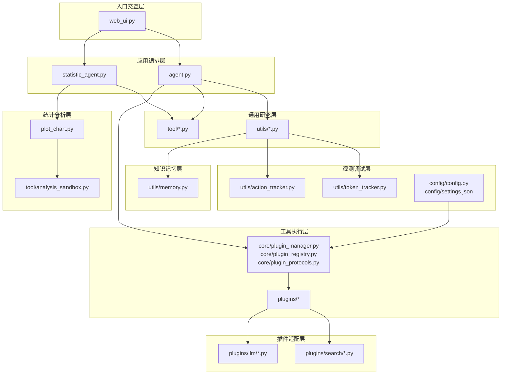
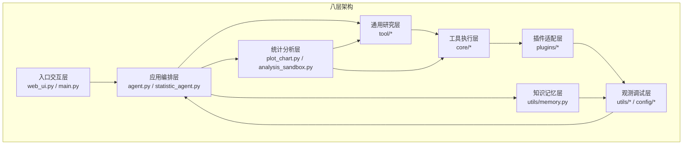
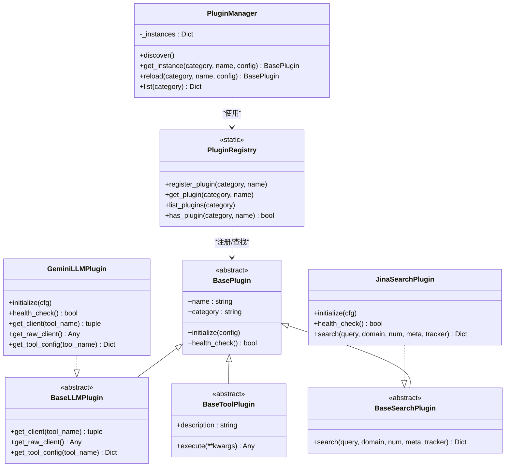
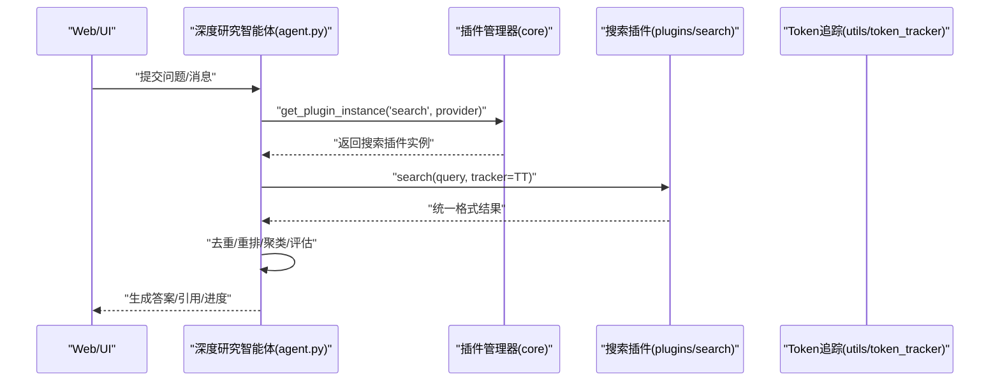
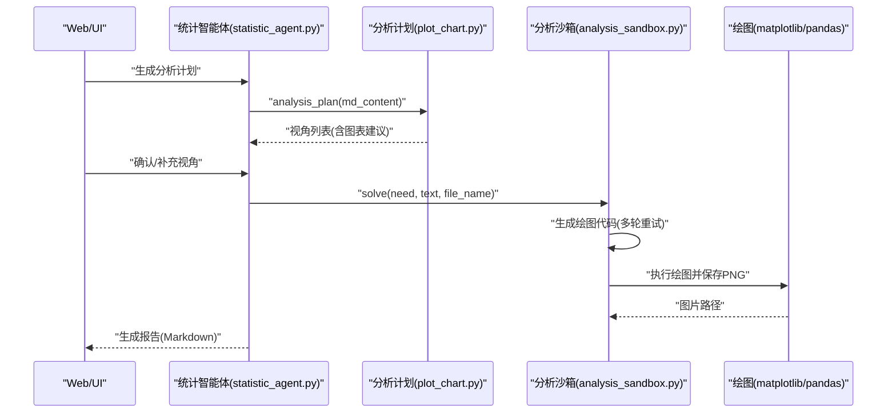
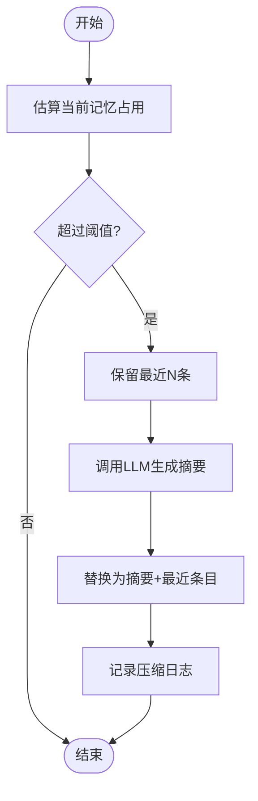
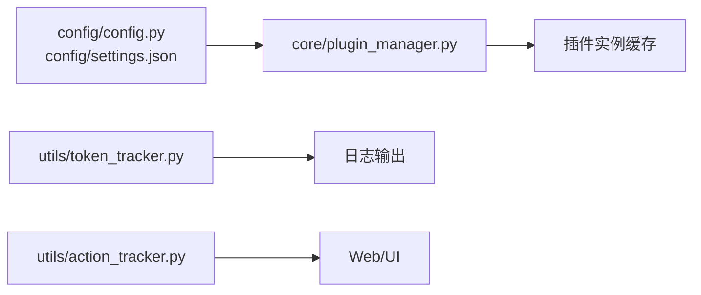
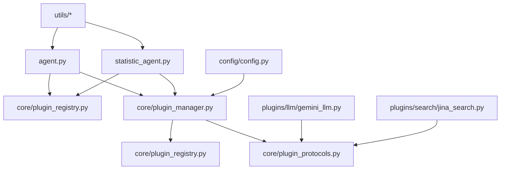

# 核心架构设计

<cite>
**本文档引用的文件**
- [main.py](file://main.py)
- [agent.py](file://agent.py)
- [statistic_agent.py](file://statistic_agent.py)
- [plugin_manager.py](file://core/plugin_manager.py)
- [plugin_protocols.py](file://core/plugin_protocols.py)
- [plugin_registry.py](file://core/plugin_registry.py)
- [gemini_llm.py](file://plugins/llm/gemini_llm.py)
- [jina_search.py](file://plugins/search/jina_search.py)
- [memory.py](file://utils/memory.py)
- [action_tracker.py](file://utils/action_tracker.py)
- [token_tracker.py](file://utils/token_tracker.py)
- [plot_chart.py](file://plot_chart.py)
- [config.py](file://config/config.py)
- [settings.json](file://config/settings.json)
- [web_ui.py](file://web_ui.py)
- [analysis_sandbox.py](file://tool/analysis_sandbox.py)
- [PLUGINS_GUIDE.md](file://PLUGINS_GUIDE.md)
</cite>

## 目录
1. [简介](#简介)
2. [项目结构](#项目结构)
3. [核心组件](#核心组件)
4. [架构总览](#架构总览)
5. [详细组件分析](#详细组件分析)
6. [依赖关系分析](#依赖关系分析)
7. [性能考虑](#性能考虑)
8. [故障排除指南](#故障排除指南)
9. [结论](#结论)
10. [附录](#附录)

## 简介
本文件为 DeepStatic 项目的八层架构设计文档，面向架构师与高级开发者，系统阐述从入口交互层到观测调试层的整体设计，深入解析插件化架构原理与实现细节，明确各层职责、交互关系与数据流，提供架构决策的技术考量与权衡，并讨论系统的可扩展性、可维护性与性能特性。

## 项目结构
DeepStatic 采用模块化分层设计，核心目录与职责如下：
- config：配置加载与模型/提供商配置
- core：插件系统（协议、注册表、管理器）
- plugins：插件实现（LLM、搜索、工具）
- tool：工具函数与分析沙箱
- utils：追踪器、内存管理、安全生成器等基础设施
- reports：生成的统计报告
- web_ui.py：Web 界面入口
- 其他脚本：示例与测试入口

**图表来源**
- [web_ui.py](file://web_ui.py)
- [agent.py](file://agent.py)
- [statistic_agent.py](file://statistic_agent.py)
- [plugin_manager.py](file://core/plugin_manager.py)
- [plugin_registry.py](file://core/plugin_registry.py)
- [plugin_protocols.py](file://core/plugin_protocols.py)
- [gemini_llm.py](file://plugins/llm/gemini_llm.py)
- [jina_search.py](file://plugins/search/jina_search.py)
- [memory.py](file://utils/memory.py)
- [action_tracker.py](file://utils/action_tracker.py)
- [token_tracker.py](file://utils/token_tracker.py)
- [plot_chart.py](file://plot_chart.py)
- [analysis_sandbox.py](file://tool/analysis_sandbox.py)
- [config.py](file://config/config.py)
- [settings.json](file://config/settings.json)

**章节来源**
- [web_ui.py](file://web_ui.py)
- [agent.py](file://agent.py)
- [statistic_agent.py](file://statistic_agent.py)
- [plugin_manager.py](file://core/plugin_manager.py)
- [plugin_registry.py](file://core/plugin_registry.py)
- [plugin_protocols.py](file://core/plugin_protocols.py)
- [gemini_llm.py](file://plugins/llm/gemini_llm.py)
- [jina_search.py](file://plugins/search/jina_search.py)
- [memory.py](file://utils/memory.py)
- [action_tracker.py](file://utils/action_tracker.py)
- [token_tracker.py](file://utils/token_tracker.py)
- [plot_chart.py](file://plot_chart.py)
- [analysis_sandbox.py](file://tool/analysis_sandbox.py)
- [config.py](file://config/config.py)
- [settings.json](file://config/settings.json)

## 核心组件
- 插件管理器与注册表：负责插件自动发现、注册、实例化与缓存，屏蔽具体提供商差异
- 插件协议：定义 LLM、搜索、工具插件的统一接口
- 搜索插件：封装第三方搜索 API，统一返回格式
- LLM 插件：封装模型客户端与工具配置
- 深度研究智能体：多步推理、检索、评估与最终答案生成
- 统计智能体：计划-执行-报告工作流，支持并行分析与可视化
- 记忆管理：上下文压缩与摘要，避免窗口溢出
- 追踪器：Token 使用与动作事件追踪
- 可视化与分析沙箱：从需求生成绘图代码并执行

**章节来源**
- [plugin_manager.py](file://core/plugin_manager.py)
- [plugin_protocols.py](file://core/plugin_protocols.py)
- [plugin_registry.py](file://core/plugin_registry.py)
- [jina_search.py](file://plugins/search/jina_search.py)
- [gemini_llm.py](file://plugins/llm/gemini_llm.py)
- [agent.py](file://agent.py)
- [statistic_agent.py](file://statistic_agent.py)
- [memory.py](file://utils/memory.py)
- [action_tracker.py](file://utils/action_tracker.py)
- [token_tracker.py](file://utils/token_tracker.py)
- [plot_chart.py](file://plot_chart.py)
- [analysis_sandbox.py](file://tool/analysis_sandbox.py)

## 架构总览
八层架构设计如下：
1. 入口交互层：Web UI 与命令行入口，负责用户交互与参数传递
2. 应用编排层：深度研究智能体与统计智能体，协调多工具与多轮对话
3. 通用研究层：检索、去重、重排、聚类、评估、最终化等工具函数
4. 统计分析层：分析计划生成、数据提取、可视化与报告合成
5. 工具执行层：插件系统统一抽象与实例化
6. 插件适配层：LLM 与搜索插件的具体实现
7. 知识记忆层：上下文压缩与摘要，维持长期对话与检索记忆
8. 观测调试层：Token 与动作追踪，配置与环境变量管理

**图表来源**
- [web_ui.py](file://web_ui.py)
- [agent.py](file://agent.py)
- [statistic_agent.py](file://statistic_agent.py)
- [plugin_manager.py](file://core/plugin_manager.py)
- [plugin_registry.py](file://core/plugin_registry.py)
- [plugin_protocols.py](file://core/plugin_protocols.py)
- [gemini_llm.py](file://plugins/llm/gemini_llm.py)
- [jina_search.py](file://plugins/search/jina_search.py)
- [memory.py](file://utils/memory.py)
- [action_tracker.py](file://utils/action_tracker.py)
- [token_tracker.py](file://utils/token_tracker.py)
- [plot_chart.py](file://plot_chart.py)
- [analysis_sandbox.py](file://tool/analysis_sandbox.py)
- [config.py](file://config/config.py)
- [settings.json](file://config/settings.json)

## 详细组件分析

### 插件化架构原理与实现
- 插件协议：定义统一的 initialize、health_check 与领域特定接口（如 LLM 的 get_client/get_tool_config、搜索的 search）
- 注册表：装饰器注册，运行时按 category/name 查找
- 管理器：自动发现 plugins 包，延迟实例化并缓存，支持热重载
- 配置驱动：settings.json 与环境变量驱动插件初始化与模型参数

**图表来源**
- [plugin_protocols.py](file://core/plugin_protocols.py)
- [plugin_manager.py](file://core/plugin_manager.py)
- [plugin_registry.py](file://core/plugin_registry.py)
- [gemini_llm.py](file://plugins/llm/gemini_llm.py)
- [jina_search.py](file://plugins/search/jina_search.py)

**章节来源**
- [plugin_protocols.py](file://core/plugin_protocols.py)
- [plugin_registry.py](file://core/plugin_registry.py)
- [plugin_manager.py](file://core/plugin_manager.py)
- [gemini_llm.py](file://plugins/llm/gemini_llm.py)
- [jina_search.py](file://plugins/search/jina_search.py)
- [PLUGINS_GUIDE.md](file://PLUGINS_GUIDE.md)

### 深度研究智能体（应用编排层）
- 多步推理：意图识别、检索、去重、重排、聚类、评估、最终化
- 记忆管理：统一知识条目，按 token 上限压缩摘要
- 动态动作选择：根据上下文与预算选择搜索/阅读/回答/反思/编码
- 插件集成：通过插件系统调用搜索与 LLM

**图表来源**
- [agent.py](file://agent.py)
- [plugin_manager.py](file://core/plugin_manager.py)
- [jina_search.py](file://plugins/search/jina_search.py)
- [token_tracker.py](file://utils/token_tracker.py)

**章节来源**
- [agent.py](file://agent.py)
- [token_tracker.py](file://utils/token_tracker.py)

### 统计智能体（统计分析层）
- 工作流：Plan → Confirm → Execute → Report
- 视角规划：从文本中提取多个分析视角，生成图表建议
- 并行执行：分析师子代理并行工作，限制并发度
- 可视化：代码生成 + 执行，支持回归、分类、对比、时间序列等
- 报告合成：将图表与原文整合为最终 Markdown 报告

**图表来源**
- [statistic_agent.py](file://statistic_agent.py)
- [plot_chart.py](file://plot_chart.py)
- [analysis_sandbox.py](file://tool/analysis_sandbox.py)

**章节来源**
- [statistic_agent.py](file://statistic_agent.py)
- [plot_chart.py](file://plot_chart.py)
- [analysis_sandbox.py](file://tool/analysis_sandbox.py)

### 知识记忆层（上下文压缩）
- 记忆条目：统一的 KnowledgeItem 结构
- 压缩策略：超过阈值时将早期记忆压缩为摘要，保留最近若干条
- 令牌估算：基于 tokenizer 或字符估算，避免上下文膨胀

**图表来源**
- [memory.py](file://utils/memory.py)

**章节来源**
- [memory.py](file://utils/memory.py)

### 观测调试层（追踪与配置）
- TokenTracker：记录各工具使用量，支持汇总与断点输出
- ActionTracker：事件驱动的动作状态追踪，支持国际化文案
- 配置系统：settings.json + 环境变量，动态模型与提供商配置

**图表来源**
- [config.py](file://config/config.py)
- [settings.json](file://config/settings.json)
- [plugin_manager.py](file://core/plugin_manager.py)
- [token_tracker.py](file://utils/token_tracker.py)
- [action_tracker.py](file://utils/action_tracker.py)
- [web_ui.py](file://web_ui.py)

**章节来源**
- [config.py](file://config/config.py)
- [settings.json](file://config/settings.json)
- [token_tracker.py](file://utils/token_tracker.py)
- [action_tracker.py](file://utils/action_tracker.py)
- [web_ui.py](file://web_ui.py)

## 依赖关系分析
- 松耦合：插件通过协议与注册表解耦，运行时按名称解析
- 可替换：搜索与 LLM 提供商可在配置与环境变量层面切换
- 事件驱动：追踪器通过事件总线推送状态，避免直接耦合
- 数据一致性：统一返回格式（如 {"response": {...}}）简化上层处理

**图表来源**
- [agent.py](file://agent.py)
- [statistic_agent.py](file://statistic_agent.py)
- [plugin_manager.py](file://core/plugin_manager.py)
- [plugin_registry.py](file://core/plugin_registry.py)
- [plugin_protocols.py](file://core/plugin_protocols.py)
- [gemini_llm.py](file://plugins/llm/gemini_llm.py)
- [jina_search.py](file://plugins/search/jina_search.py)
- [config.py](file://config/config.py)

**章节来源**
- [agent.py](file://agent.py)
- [statistic_agent.py](file://statistic_agent.py)
- [plugin_manager.py](file://core/plugin_manager.py)
- [plugin_registry.py](file://core/plugin_registry.py)
- [plugin_protocols.py](file://core/plugin_protocols.py)
- [gemini_llm.py](file://plugins/llm/gemini_llm.py)
- [jina_search.py](file://plugins/search/jina_search.py)
- [config.py](file://config/config.py)

## 性能考虑
- 并发与限流：统计智能体使用信号量限制并行分析师数量，避免 LLM 服务过载
- 异步 I/O：搜索与绘图代码生成采用异步，提升吞吐
- 上下文压缩：记忆管理避免长对话导致的 token 溢出
- 配置化模型：不同工具使用不同模型与温度/上下文长度，平衡质量与成本
- 缓存与热重载：插件实例缓存减少初始化开销，支持配置热更新

[本节为通用性能讨论，不直接分析具体文件]

## 故障排除指南
- 插件未注册：检查装饰器注册与 discover 是否执行，确认 category/name 正确
- API Key 缺失：确保环境变量或 settings.json 中配置正确
- 搜索/LLM 调用失败：查看 TokenTracker 汇总与 ActionTracker 事件，定位失败步骤
- 图表生成失败：分析沙箱重试日志，修正绘图代码提示

**章节来源**
- [plugin_registry.py](file://core/plugin_registry.py)
- [plugin_manager.py](file://core/plugin_manager.py)
- [token_tracker.py](file://utils/token_tracker.py)
- [action_tracker.py](file://utils/action_tracker.py)
- [analysis_sandbox.py](file://tool/analysis_sandbox.py)

## 结论
DeepStatic 通过八层架构实现了清晰的职责分离与高度可插拔的系统设计。插件化架构使得 LLM 与搜索提供商可灵活替换，统计智能体支持并行分析与高质量可视化，记忆与追踪体系保障了长对话与可观测性。该设计在可扩展性、可维护性与性能之间取得良好平衡，适合持续演进与企业级应用。

[本节为总结性内容，不直接分析具体文件]

## 附录
- 插件接入指南：遵循协议与装饰器注册，提供 initialize/health_check/search/get_client 等实现
- 配置参考：settings.json 中 providers/models 字段与环境变量映射
- Web UI：支持动态切换提供商与自定义 API Key/URL，实时预览与下载报告

**章节来源**
- [PLUGINS_GUIDE.md](file://PLUGINS_GUIDE.md)
- [settings.json](file://config/settings.json)
- [web_ui.py](file://web_ui.py)