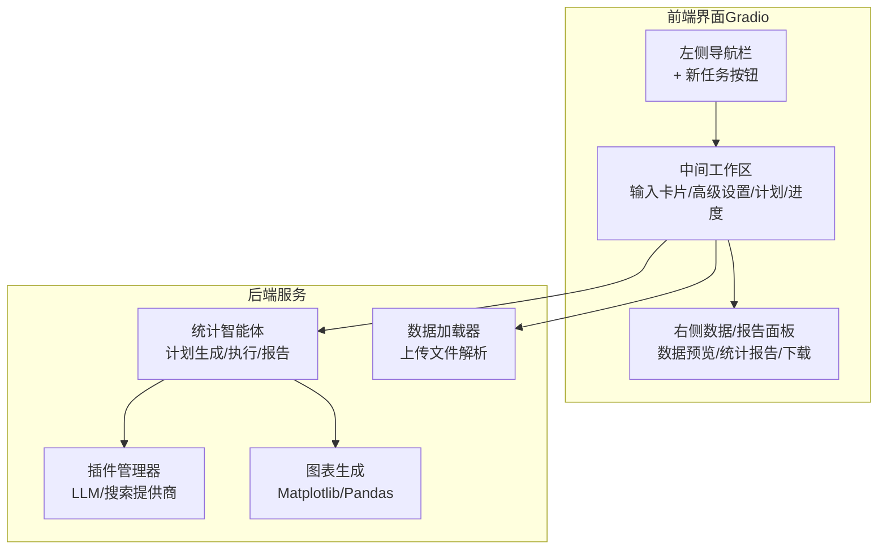
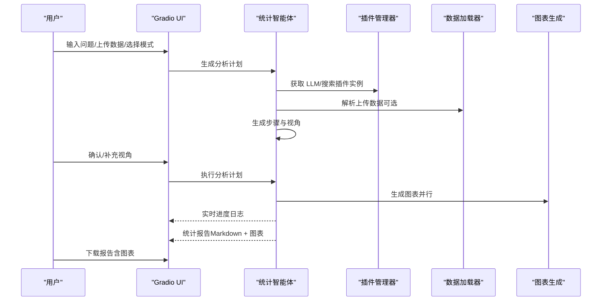
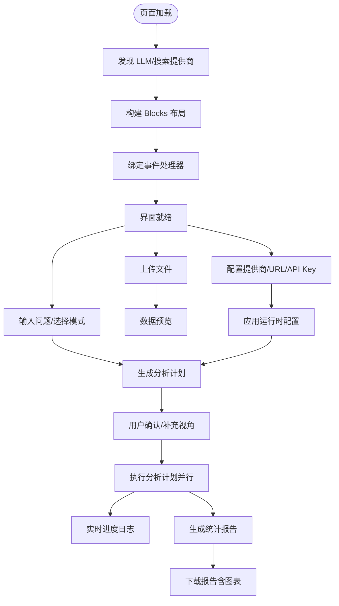
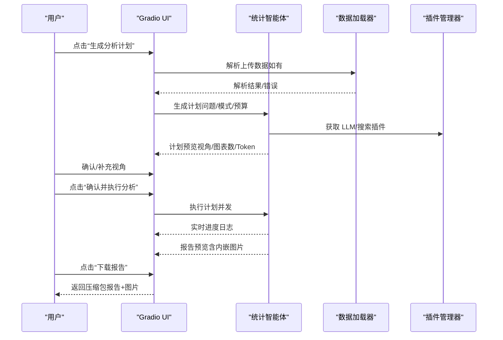
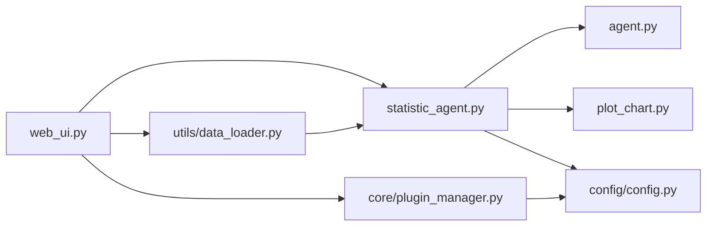

# 用户界面系统

<cite>
**本文档引用的文件**
- [web_ui.py](file://web_ui.py)
- [statistic_agent.py](file://statistic_agent.py)
- [agent.py](file://agent.py)
- [config/config.py](file://config/config.py)
- [core/plugin_manager.py](file://core/plugin_manager.py)
- [utils/data_loader.py](file://utils/data_loader.py)
- [plot_chart.py](file://plot_chart.py)
- [requirements.txt](file://requirements.txt)
- [tool/i18n.json](file://tool/i18n.json)
</cite>

## 目录
1. [简介](#简介)
2. [项目结构](#项目结构)
3. [核心组件](#核心组件)
4. [架构总览](#架构总览)
5. [详细组件分析](#详细组件分析)
6. [依赖关系分析](#依赖关系分析)
7. [性能考虑](#性能考虑)
8. [故障排除指南](#故障排除指南)
9. [结论](#结论)
10. [附录](#附录)

## 简介
本文件为 DeepStatic 项目的用户界面系统文档，聚焦 Web UI 的架构设计与实现原理，涵盖 Gradio 集成、界面布局、交互逻辑、功能模块（问题输入、配置管理、结果显示、进度反馈）、响应式设计与用户体验优化、界面定制与主题修改、与后端服务的通信机制与数据传输格式、调试与问题排查、多语言支持与本地化配置，以及面向 UI 开发者的扩展与功能添加指导。

## 项目结构
Web UI 采用 Gradio 5.x 构建，结合插件化搜索与 LLM 提供商、统计分析代理与报告生成流程，形成“输入 → 计划 → 执行 → 报告”的完整工作流。界面采用三栏式布局（左侧导航、中间工作区、右侧数据/报告面板），通过 CSS 自定义实现现代化视觉风格，并通过事件队列实现实时进度推送。

**图表来源**
- [web_ui.py:262-667](file://web_ui.py#L262-L667)
- [statistic_agent.py:187-674](file://statistic_agent.py#L187-L674)
- [core/plugin_manager.py:20-121](file://core/plugin_manager.py#L20-L121)
- [utils/data_loader.py:1-200](file://utils/data_loader.py#L1-L200)
- [plot_chart.py:1-200](file://plot_chart.py#L1-L200)

**章节来源**
- [web_ui.py:262-667](file://web_ui.py#L262-L667)

## 核心组件
- Gradio 界面构建器：创建 Blocks 布局，定义状态变量、事件绑定与 UI 组件。
- 统计智能体：负责分析计划生成、步骤执行、并行分析团队调度、报告生成。
- 插件管理器：动态发现与实例化 LLM/搜索插件，支持运行时配置热更新。
- 数据加载器：解析用户上传的多种格式数据，生成文本描述与落地 CSV。
- 图表生成：基于分析结果生成统计图表，支持多种图表类型与优先级控制。
- 配置系统：运行时读取环境变量，应用 LLM/搜索提供商配置变更。

**章节来源**
- [web_ui.py:262-667](file://web_ui.py#L262-L667)
- [statistic_agent.py:187-674](file://statistic_agent.py#L187-L674)
- [core/plugin_manager.py:20-121](file://core/plugin_manager.py#L20-L121)
- [utils/data_loader.py:1-200](file://utils/data_loader.py#L1-L200)
- [plot_chart.py:1-200](file://plot_chart.py#L1-L200)
- [config/config.py:60-155](file://config/config.py#L60-L155)

## 架构总览
Web UI 通过 Gradio 事件驱动，将用户输入传递至统计智能体；统计智能体根据模式（报告生成/归因分析/数据生成）生成分析计划，用户可在前端确认/调整；随后并行执行分析步骤，实时推送进度；最终生成包含图表的 Markdown 报告并支持下载。

**图表来源**
- [web_ui.py:478-643](file://web_ui.py#L478-L643)
- [statistic_agent.py:218-495](file://statistic_agent.py#L218-L495)
- [core/plugin_manager.py:54-84](file://core/plugin_manager.py#L54-L84)
- [utils/data_loader.py:116-178](file://utils/data_loader.py#L116-L178)
- [plot_chart.py:195-200](file://plot_chart.py#L195-L200)

## 详细组件分析

### Gradio 界面与布局
- 三栏式布局：左侧导航（品牌标识、新任务按钮）、中间工作区（输入卡片、高级设置、计划/进度展示）、右侧数据/报告面板（数据预览、报告预览、下载）。
- 状态管理：使用 gr.State 维护当前计划与报告文件路径，确保跨事件的持久化。
- 主题与样式：基于 Soft 主题与自定义 CSS，实现现代化视觉风格与响应式布局。
- 事件绑定：示例任务点击、新任务重置、文件上传预览、提供商切换、生成计划、执行分析、下载报告。

**图表来源**
- [web_ui.py:262-667](file://web_ui.py#L262-L667)

**章节来源**
- [web_ui.py:262-667](file://web_ui.py#L262-L667)

### 功能模块详解

#### 问题输入与数据上传
- 问题输入：多行文本框，支持示例任务一键填充。
- 数据上传：支持 CSV/Excel/JSON/TXT/Markdown 多选；扩展名校验由后端完成；上传后实时解析并在右侧面板预览。
- 上传数据优先策略：一旦存在上传数据，执行阶段将跳过联网检索，直接基于上传数据进行分析。

**章节来源**
- [web_ui.py:303-315](file://web_ui.py#L303-L315)
- [web_ui.py:434-466](file://web_ui.py#L434-L466)
- [utils/data_loader.py:70-178](file://utils/data_loader.py#L70-L178)

#### 配置管理与运行时应用
- 高级设置：搜索提供商、URL 地址、API Key；LLM URL 地址、API Key。
- 运行时应用：通过环境变量与插件管理器热更新，确保新配置立即生效；LLM 插件缓存清理，搜索插件重建实例。
- 提供商发现：自动发现 plugins/ 目录下的 LLM 与搜索插件，动态列出可用提供商。

**章节来源**
- [web_ui.py:341-367](file://web_ui.py#L341-L367)
- [web_ui.py:147-183](file://web_ui.py#L147-L183)
- [core/plugin_manager.py:27-84](file://core/plugin_manager.py#L27-L84)
- [config/config.py:60-94](file://config/config.py#L60-L94)

#### 分析计划与执行
- 计划生成：根据问题与模式生成多个分析视角与步骤，支持估计图表数与 Token 预算。
- 用户确认：可选择执行特定视角，或补充自定义视角。
- 并行执行：按视角分组，构建分析团队，限制并发数，实时推送进度。
- 执行策略：优先使用上传数据；无上传数据时可选择联网检索或仅基于问题描述分析。

**章节来源**
- [statistic_agent.py:218-495](file://statistic_agent.py#L218-L495)
- [web_ui.py:478-643](file://web_ui.py#L478-L643)

#### 结果展示与下载
- 数据预览：上传数据解析后的概览与描述性统计。
- 报告预览：Markdown 渲染，支持 LaTeX 块；本地图片自动内嵌为 base64。
- 下载：将报告与引用的图片打包为 zip，确保下载后图片可正确显示。

**章节来源**
- [web_ui.py:395-407](file://web_ui.py#L395-L407)
- [web_ui.py:645-657](file://web_ui.py#L645-L657)
- [web_ui.py:73-144](file://web_ui.py#L73-L144)

### 交互逻辑与事件流

**图表来源**
- [web_ui.py:478-657](file://web_ui.py#L478-L657)
- [statistic_agent.py:347-495](file://statistic_agent.py#L347-L495)
- [utils/data_loader.py:116-178](file://utils/data_loader.py#L116-L178)
- [core/plugin_manager.py:54-84](file://core/plugin_manager.py#L54-L84)

## 依赖关系分析

**图表来源**
- [web_ui.py:262-667](file://web_ui.py#L262-L667)
- [statistic_agent.py:187-674](file://statistic_agent.py#L187-L674)
- [agent.py:1-800](file://agent.py#L1-L800)
- [plot_chart.py:1-200](file://plot_chart.py#L1-L200)
- [config/config.py:1-155](file://config/config.py#L1-L155)
- [core/plugin_manager.py:1-121](file://core/plugin_manager.py#L1-L121)
- [utils/data_loader.py:1-200](file://utils/data_loader.py#L1-L200)

**章节来源**
- [requirements.txt:1-111](file://requirements.txt#L1-L111)

## 性能考虑
- 并发控制：通过信号量限制分析团队并发数，避免对 LLM 服务造成过大压力。
- 事件队列：启用 Gradio 队列，确保生成器式事件能实时推送进度，避免前端假死。
- 图片处理：将 Markdown 中的本地图片内嵌为 base64，减少前端请求与跨域问题。
- 数据落地：上传数据落地为 CSV，避免将大体量数据塞入 LLM 文本，降低截断与错误风险。
- Token 预算：根据计划估计 Token，结合预算控制分析深度与范围。

[本节为通用性能讨论，无需引用具体文件]

## 故障排除指南
- Gradio 1.4.0 兼容性：针对布尔型 additionalProperties 的 schema 问题，提供最小化补丁，避免 /info 接口 500 错误。
- 权限与占用：Windows 下上传文件可能被占用导致权限错误，采用读取字节并重试的方式规避。
- API Key/URL 配置：确认环境变量与插件配置正确；LLM 插件缓存需清理以应用新配置；搜索插件需重建实例。
- 进度不刷新：确认已启用队列；检查回调函数注册与异常处理。
- 图片显示异常：确认本地图片路径存在；检查 base64 内嵌逻辑与相对路径。

**章节来源**
- [web_ui.py:10-27](file://web_ui.py#L10-L27)
- [utils/data_loader.py:49-67](file://utils/data_loader.py#L49-L67)
- [web_ui.py:147-183](file://web_ui.py#L147-L183)

## 结论
DeepStatic 的 Web UI 以 Gradio 为核心，结合插件化 LLM/搜索、统计智能体与报告生成，实现了从问题输入到报告下载的完整闭环。界面采用现代化三栏布局与自定义主题，配合事件队列与实时进度推送，提供了良好的用户体验。通过运行时配置与数据落地策略，系统兼顾灵活性与稳定性，适合在多场景下进行扩展与定制。

[本节为总结性内容，无需引用具体文件]

## 附录

### 界面使用指南与操作示例
- 新建任务：点击“+ 新任务”重置界面。
- 示例任务：点击示例按钮快速填入问题。
- 上传数据：选择 CSV/Excel/JSON/TXT/Markdown 文件，查看预览并自动禁用联网检索。
- 配置提供商：在“高级设置”中选择搜索/LLM 提供商，填写 URL 与 API Key。
- 生成计划：输入问题后点击“生成分析计划”，查看视角与图表/Token 预估。
- 确认执行：可选择执行特定视角或补充自定义视角，点击“确认并执行分析”。
- 查看报告：右侧面板预览报告，支持 LaTeX 公式；点击“下载报告（含图表）”。

**章节来源**
- [web_ui.py:414-432](file://web_ui.py#L414-L432)
- [web_ui.py:410-413](file://web_ui.py#L410-L413)
- [web_ui.py:434-466](file://web_ui.py#L434-L466)
- [web_ui.py:478-643](file://web_ui.py#L478-L643)

### 响应式设计与用户体验优化
- 布局：三栏式设计，左右面板固定宽度，中间工作区自适应。
- 主题：Soft 主题 + 自定义 CSS，提升可读性与一致性。
- 交互：按钮渐变色、阴影与圆角，增强触控反馈；进度滚动文本框便于跟踪。
- 图片：自动内嵌 base64，避免跨域与路径问题。

**章节来源**
- [web_ui.py:187-257](file://web_ui.py#L187-L257)

### 界面定制与主题修改
- 自定义 CSS：通过 elem_id 与 elem_classes 控制样式，可扩展颜色、字体与间距。
- 主题：可更换 Gradio 主题或自定义主题类。
- 组件尺寸：Column/scale 与 min-width 控制布局弹性。

**章节来源**
- [web_ui.py:266-267](file://web_ui.py#L266-L267)
- [web_ui.py:187-257](file://web_ui.py#L187-L257)

### 与后端服务通信机制与数据传输
- 前端事件：Gradio 事件触发，传递输入参数（问题、文件、模式、配置）。
- 后端处理：统计智能体异步生成计划与执行，通过回调推送进度。
- 数据格式：上传文件为二进制字节，解析为 DataFrame 并落地 CSV；报告为 Markdown 文本，必要时内嵌 base64 图片。
- 插件协议：通过插件管理器统一获取实例，支持热更新与缓存。

**章节来源**
- [web_ui.py:478-643](file://web_ui.py#L478-L643)
- [statistic_agent.py:218-495](file://statistic_agent.py#L218-L495)
- [utils/data_loader.py:70-178](file://utils/data_loader.py#L70-L178)
- [core/plugin_manager.py:54-84](file://core/plugin_manager.py#L54-L84)

### 多语言支持与本地化配置
- 国际化资源：提供多语言键值映射，覆盖常见语言。
- 语言设置：通过语言代码与风格设置影响提示词与输出风格。
- 本地化建议：可在前端增加语言切换按钮，动态加载 i18n 资源并刷新界面文案。

**章节来源**
- [tool/i18n.json:1-170](file://tool/i18n.json#L1-L170)
- [utils/schemas.py:75-87](file://utils/schemas.py#L75-L87)

### UI 开发者扩展与功能添加指导
- 新增提供商：在 plugins/ 目录新增模块并通过装饰器注册；在前端通过插件管理器自动发现。
- 新增 UI 组件：在 Blocks 中添加组件并绑定事件；注意状态变量与可见性控制。
- 新增分析模式：在统计智能体中扩展模式引导与标题映射，确保报告生成与摘要逻辑一致。
- 新增图表类型：在图表规格中扩展类型枚举与生成逻辑，确保与分析结果匹配。
- 性能优化：合理设置并发数与队列大小；对大文件与长文本进行分块处理与缓存。

**章节来源**
- [core/plugin_manager.py:27-84](file://core/plugin_manager.py#L27-L84)
- [statistic_agent.py:36-66](file://statistic_agent.py#L36-L66)
- [plot_chart.py:112-165](file://plot_chart.py#L112-L165)
- [web_ui.py:262-667](file://web_ui.py#L262-L667)