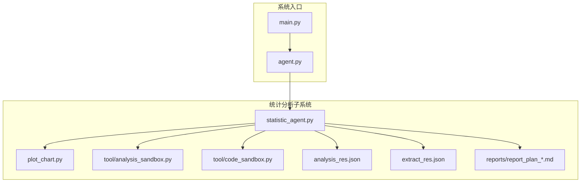
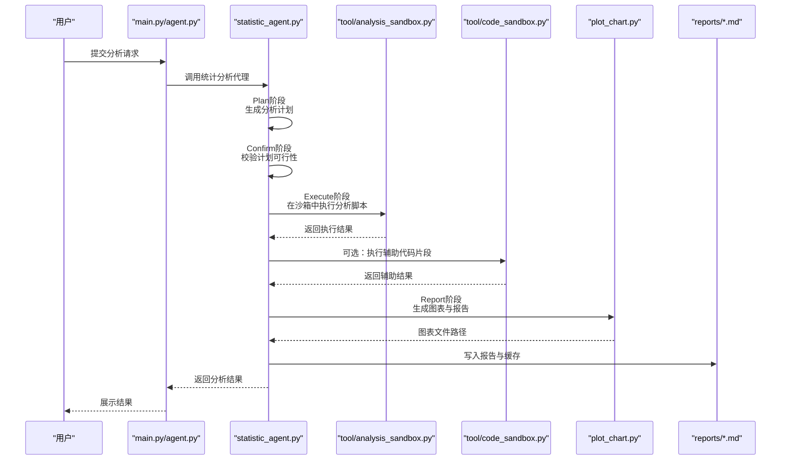
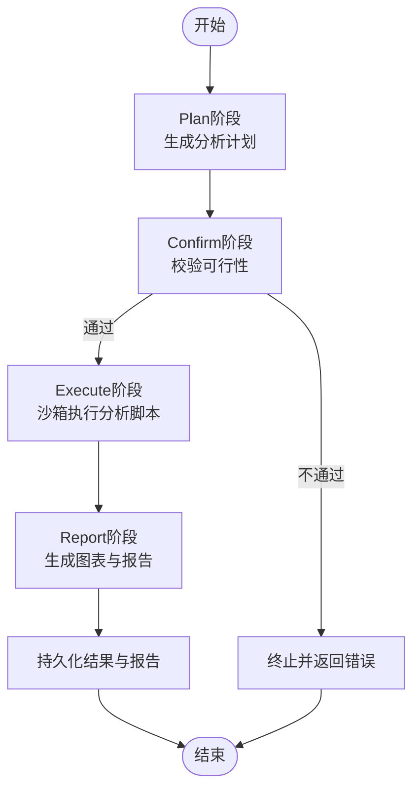
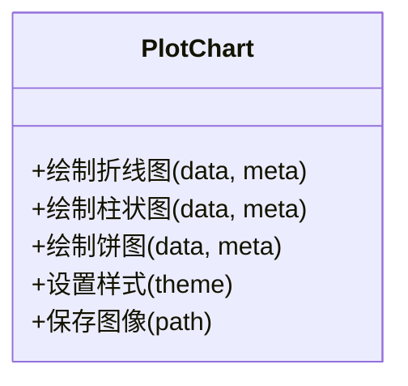
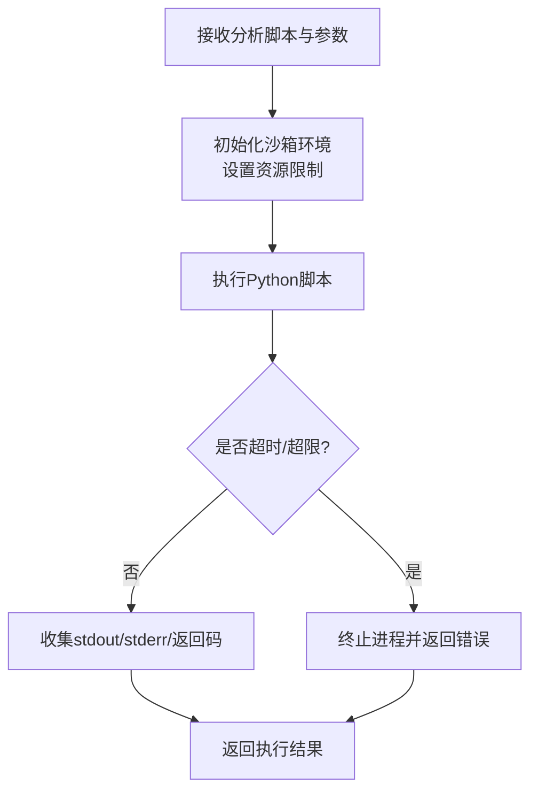
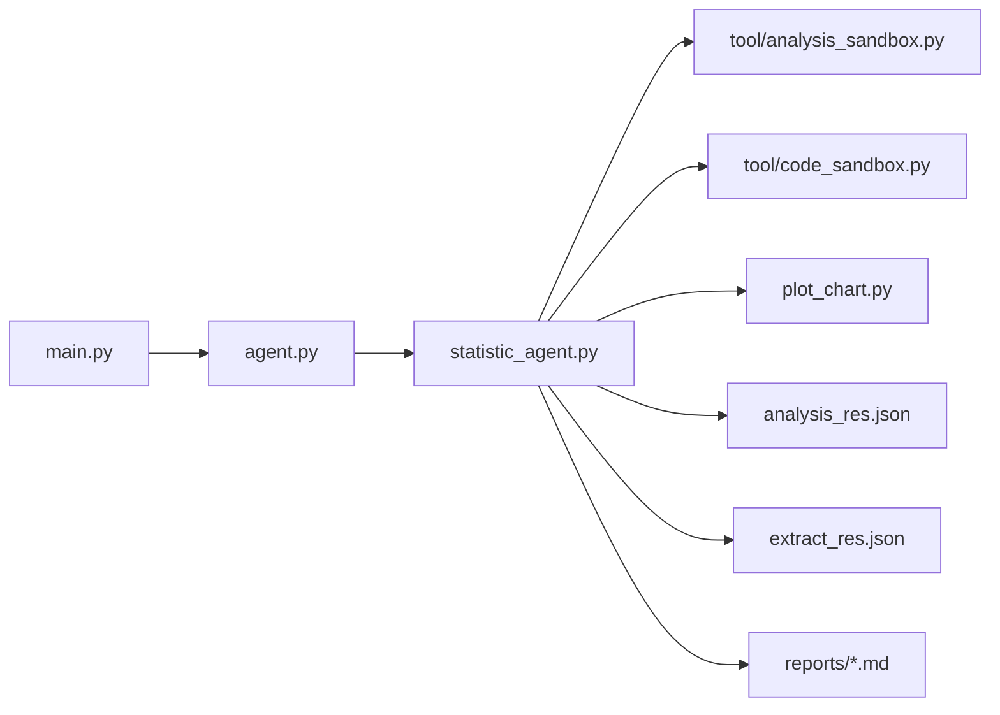

# 统计分析功能

<cite>
**本文引用的文件**
- [statistic_agent.py](file://statistic_agent.py)
- [plot_chart.py](file://plot_chart.py)
- [tool/analysis_sandbox.py](file://tool/analysis_sandbox.py)
- [tool/code_sandbox.py](file://tool/code_sandbox.py)
- [main.py](file://main.py)
- [agent.py](file://agent.py)
- [analysis_res.json](file://analysis_res.json)
- [extract_res.json](file://extract_res.json)
- [reports/report_plan_20260603105034.md](file://reports/report_plan_20260603105034.md)
</cite>

## 目录
1. [简介](#简介)
2. [项目结构](#项目结构)
3. [核心组件](#核心组件)
4. [架构总览](#架构总览)
5. [详细组件分析](#详细组件分析)
6. [依赖关系分析](#依赖关系分析)
7. [性能考虑](#性能考虑)
8. [故障排查指南](#故障排查指南)
9. [结论](#结论)
10. [附录](#附录)

## 简介
本文件面向DeepStatic项目的统计分析功能，系统性阐述统计分析代理（Statistic Agent）的工作原理与实现机制，覆盖以下主题：
- AgentTeam并行分析架构与任务分发
- 分析计划生成、数据抽取与图表生成的完整流程
- 代码沙箱安全机制与执行环境控制
- 统计分析四阶段（Plan、Confirm、Execute、Report）的详细流程与实现要点
- 典型统计分析示例与结果展示
- 可视化生成与报告输出格式
- 性能优化与资源管理策略
- 使用指南与最佳实践
- 与系统其他组件的集成方式

## 项目结构
统计分析功能涉及的核心文件与职责如下：
- statistic_agent.py：统计分析代理主入口，负责接收用户意图、生成分析计划、调度执行与报告生成
- plot_chart.py：图表绘制模块，封装matplotlib等绘图逻辑，支持多种图表类型
- tool/analysis_sandbox.py：分析代码沙箱，隔离执行Python分析脚本，限制资源与I/O访问
- tool/code_sandbox.py：通用代码沙箱，用于安全执行任意Python代码片段
- main.py、agent.py：应用入口与通用Agent框架，承载调度与上下文传递
- analysis_res.json、extract_res.json：分析中间结果与抽取结果缓存
- reports/report_plan_*.md：分析计划与报告产物

**图表来源**
- [statistic_agent.py](file://statistic_agent.py)
- [plot_chart.py](file://plot_chart.py)
- [tool/analysis_sandbox.py](file://tool/analysis_sandbox.py)
- [tool/code_sandbox.py](file://tool/code_sandbox.py)
- [main.py](file://main.py)
- [agent.py](file://agent.py)
- [analysis_res.json](file://analysis_res.json)
- [extract_res.json](file://extract_res.json)
- [reports/report_plan_20260603105034.md](file://reports/report_plan_20260603105034.md)

**章节来源**
- [statistic_agent.py](file://statistic_agent.py)
- [plot_chart.py](file://plot_chart.py)
- [tool/analysis_sandbox.py](file://tool/analysis_sandbox.py)
- [tool/code_sandbox.py](file://tool/code_sandbox.py)
- [main.py](file://main.py)
- [agent.py](file://agent.py)
- [analysis_res.json](file://analysis_res.json)
- [extract_res.json](file://extract_res.json)
- [reports/report_plan_20260603105034.md](file://reports/report_plan_20260603105034.md)

## 核心组件
- 统计分析代理（Statistic Agent）
  - 负责解析用户意图，生成可执行的分析计划；协调数据抽取、代码执行与图表生成；汇总报告并持久化
- 图表绘制模块（Plot Chart）
  - 封装常用图表类型（折线、柱状、饼图等），统一样式与保存路径
- 分析代码沙箱（Analysis Sandbox）
  - 隔离执行Python分析脚本，限制CPU/内存/时间/文件系统访问，防止越权操作
- 通用代码沙箱（Code Sandbox）
  - 提供更基础的执行控制能力，用于安全地运行短小的Python片段
- 报告与缓存
  - 中间结果与最终报告分别写入analysis_res.json、extract_res.json与report目录

**章节来源**
- [statistic_agent.py](file://statistic_agent.py)
- [plot_chart.py](file://plot_chart.py)
- [tool/analysis_sandbox.py](file://tool/analysis_sandbox.py)
- [tool/code_sandbox.py](file://tool/code_sandbox.py)
- [analysis_res.json](file://analysis_res.json)
- [extract_res.json](file://extract_res.json)
- [reports/report_plan_20260603105034.md](file://reports/report_plan_20260603105034.md)

## 架构总览
统计分析采用“代理-沙箱-绘图-报告”的分层架构。Agent负责编排，沙箱负责安全执行，绘图模块负责可视化，报告模块负责产物沉淀。

**图表来源**
- [statistic_agent.py](file://statistic_agent.py)
- [tool/analysis_sandbox.py](file://tool/analysis_sandbox.py)
- [tool/code_sandbox.py](file://tool/code_sandbox.py)
- [plot_chart.py](file://plot_chart.py)
- [reports/report_plan_20260603105034.md](file://reports/report_plan_20260603105034.md)

## 详细组件分析

### 统计分析代理（Statistic Agent）
- 角色与职责
  - 解析用户输入，生成可执行的分析计划（含数据源、字段、计算逻辑、图表类型）
  - 协调数据抽取与清洗，驱动沙箱执行分析脚本
  - 调用绘图模块生成图表，并生成结构化报告
  - 持久化中间结果与最终报告
- 并行分析架构（AgentTeam）
  - 支持多Agent并行执行不同维度的分析任务，通过任务队列与结果聚合实现高吞吐
  - 各Agent之间通过共享缓存与消息通道进行解耦协作
- 四阶段流程
  - Plan：根据用户意图生成候选分析方案，选择最优方案并产出执行清单
  - Confirm：对方案进行可行性校验（数据可用性、字段存在性、计算复杂度评估）
  - Execute：在分析沙箱中执行Python分析脚本，返回数值结果与中间变量
  - Report：将结果映射到图表模板，生成图片与Markdown报告

**图表来源**
- [statistic_agent.py](file://statistic_agent.py)

**章节来源**
- [statistic_agent.py](file://statistic_agent.py)

### 图表绘制模块（Plot Chart）
- 功能概述
  - 封装常用图表类型（折线、柱状、饼图、堆叠图等），统一样式与保存路径
  - 支持中文显示、图例与标题配置、自动布局与导出
- 输出格式
  - 图片文件（PNG/JPG）与Markdown嵌入链接，便于报告集成
- 与统计分析代理的交互
  - 接收数值矩阵与元数据，返回图表文件路径，由代理写入报告

**图表来源**
- [plot_chart.py](file://plot_chart.py)

**章节来源**
- [plot_chart.py](file://plot_chart.py)

### 分析代码沙箱（Analysis Sandbox）
- 安全机制
  - 进程级隔离：独立进程执行，限制CPU/内存/IO访问
  - 文件系统白名单：仅允许读取指定数据目录，禁止写入
  - 超时与超限保护：设定最大执行时间与内存上限，防止资源滥用
  - 网络访问禁用：默认关闭网络，避免外部依赖
- 执行控制
  - 输入：分析脚本字符串、参数字典、工作目录
  - 输出：标准输出、标准错误、返回码、执行耗时
- 错误处理
  - 捕获语法错误、运行时异常、超时与资源限制错误
  - 区分可控错误（如数据缺失）与不可控错误（如无限循环）

**图表来源**
- [tool/analysis_sandbox.py](file://tool/analysis_sandbox.py)

**章节来源**
- [tool/analysis_sandbox.py](file://tool/analysis_sandbox.py)

### 通用代码沙箱（Code Sandbox）
- 适用场景
  - 执行短小的Python片段（如数据清洗、字段转换、辅助计算）
- 控制粒度
  - 与分析沙箱类似，但更轻量，适合高频次、低风险的片段执行
- 与分析沙箱的关系
  - 分析沙箱用于执行完整的分析脚本；代码沙箱用于执行辅助片段

**章节来源**
- [tool/code_sandbox.py](file://tool/code_sandbox.py)

### 报告与缓存
- 中间结果
  - analysis_res.json：分析过程中的数值结果与中间变量
  - extract_res.json：抽取阶段的原始数据与清洗后数据
- 最终报告
  - reports/report_plan_*.md：包含图表链接、结论摘要与方法说明的Markdown报告

**章节来源**
- [analysis_res.json](file://analysis_res.json)
- [extract_res.json](file://extract_res.json)
- [reports/report_plan_20260603105034.md](file://reports/report_plan_20260603105034.md)

## 依赖关系分析
- 统计分析代理依赖
  - 工具层：analysis_sandbox、code_sandbox
  - 可视化层：plot_chart
  - 数据层：analysis_res.json、extract_res.json
  - 报告层：reports目录下的Markdown文件
- 与系统入口的集成
  - main.py与agent.py作为统一调度入口，将用户请求路由至statistic_agent

**图表来源**
- [main.py](file://main.py)
- [agent.py](file://agent.py)
- [statistic_agent.py](file://statistic_agent.py)
- [tool/analysis_sandbox.py](file://tool/analysis_sandbox.py)
- [tool/code_sandbox.py](file://tool/code_sandbox.py)
- [plot_chart.py](file://plot_chart.py)
- [analysis_res.json](file://analysis_res.json)
- [extract_res.json](file://extract_res.json)
- [reports/report_plan_20260603105034.md](file://reports/report_plan_20260603105034.md)

**章节来源**
- [main.py](file://main.py)
- [agent.py](file://agent.py)
- [statistic_agent.py](file://statistic_agent.py)
- [tool/analysis_sandbox.py](file://tool/analysis_sandbox.py)
- [tool/code_sandbox.py](file://tool/code_sandbox.py)
- [plot_chart.py](file://plot_chart.py)
- [analysis_res.json](file://analysis_res.json)
- [extract_res.json](file://extract_res.json)
- [reports/report_plan_20260603105034.md](file://reports/report_plan_20260603105034.md)

## 性能考虑
- 并行化策略
  - AgentTeam按维度拆分任务，最大化利用CPU核数；通过队列与锁避免竞态
- 资源限制
  - 沙箱内设置CPU/内存/时间上限，防止单任务拖垮整体
- 缓存与复用
  - analysis_res.json与extract_res.json用于中间结果缓存，减少重复计算
- I/O优化
  - 图表批量生成，延迟写盘；统一命名规则便于检索
- 超时与重试
  - 对不稳定任务设置超时与有限重试，失败即记录日志并回退

[本节为通用性能建议，无需列出具体文件来源]

## 故障排查指南
- 常见问题
  - 分析脚本报错：检查沙箱日志与返回码，定位语法或运行时异常
  - 超时/超限：调整资源配额或简化分析逻辑
  - 图表生成失败：确认数据格式与字段名，检查绘图模块依赖
  - 报告未生成：检查报告目录权限与路径拼接
- 定位手段
  - 查看analysis_res.json与extract_res.json中的中间结果
  - 在沙箱中单独执行最小可复现脚本，逐步缩小范围
  - 检查reports目录下对应报告文件是否存在与内容是否完整

**章节来源**
- [tool/analysis_sandbox.py](file://tool/analysis_sandbox.py)
- [plot_chart.py](file://plot_chart.py)
- [analysis_res.json](file://analysis_res.json)
- [extract_res.json](file://extract_res.json)
- [reports/report_plan_20260603105034.md](file://reports/report_plan_20260603105034.md)

## 结论
统计分析功能通过“代理-沙箱-绘图-报告”分层架构实现了从意图到可视化的端到端闭环。AgentTeam并行化提升了吞吐，沙箱确保了执行安全，绘图模块提供了统一的可视化能力，报告与缓存保障了可追溯性与复用性。结合合理的性能优化与故障排查策略，该功能可在生产环境中稳定高效地支撑各类统计分析需求。

[本节为总结性内容，无需列出具体文件来源]

## 附录

### 使用指南与最佳实践
- 输入规范
  - 明确分析目标与数据范围，提供必要的字段与过滤条件
- 计划生成
  - 优先选择可解释性强、计算开销低的方案；必要时拆分为多个子任务
- 执行控制
  - 将长耗时分析放入分析沙箱，短小片段放入代码沙箱；合理设置资源上限
- 可视化建议
  - 优先使用折线/柱状图表达趋势，饼图用于结构占比；确保中文显示与清晰标注
- 报告输出
  - 在报告中包含方法说明、图表链接与结论摘要，便于复用与审计

[本节为通用指导，无需列出具体文件来源]

### 示例与结果展示
- 示例场景
  - 某业务指标月度趋势分析：Plan阶段生成时间序列分析方案；Confirm阶段校验时间字段与数据完整性；Execute阶段在沙箱中执行聚合与回归分析；Report阶段生成趋势图与简要结论
- 结果形态
  - 图表文件（PNG）与Markdown报告（.md），并写入analysis_res.json与reports目录

[本节为概念性示例，无需列出具体文件来源]