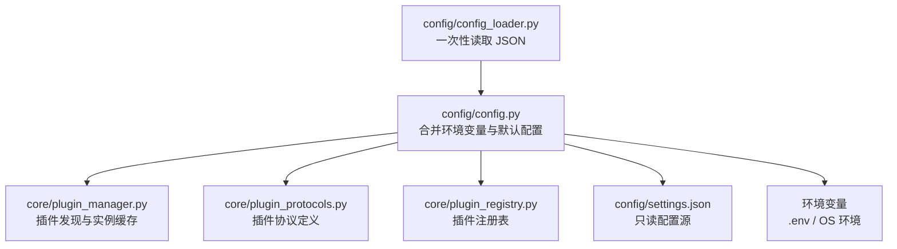
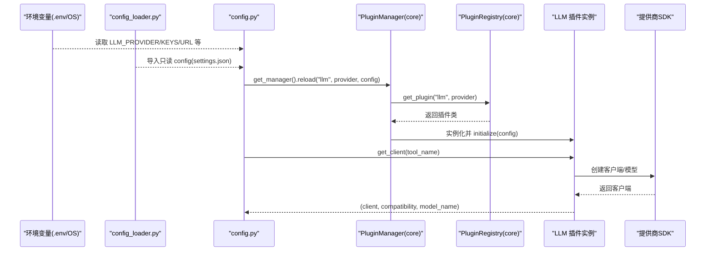
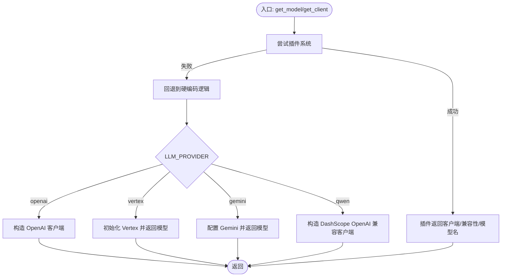
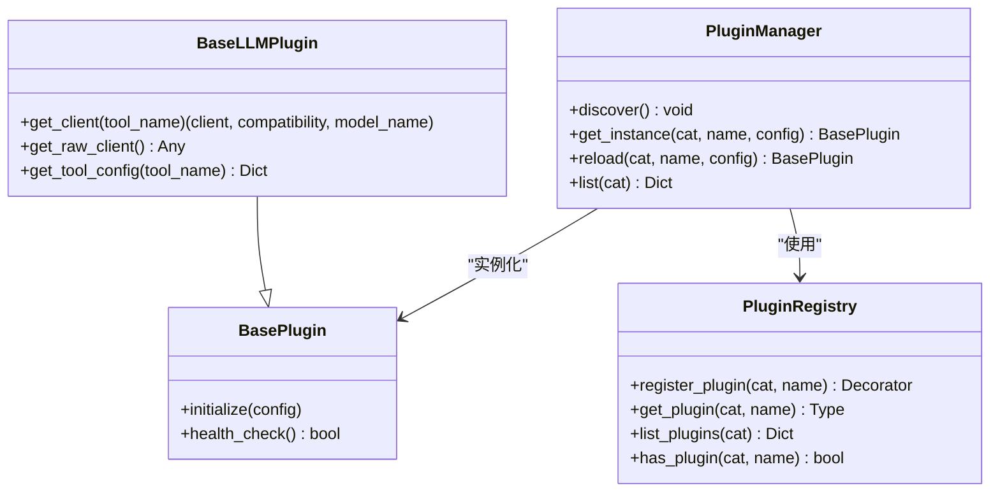
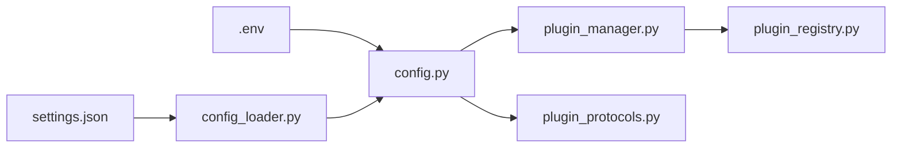

# 配置管理系统

<cite>
**本文引用的文件**
- [config.py](file://config/config.py)
- [config_loader.py](file://config/config_loader.py)
- [settings.json](file://config/settings.json)
- [plugin_manager.py](file://core/plugin_manager.py)
- [plugin_protocols.py](file://core/plugin_protocols.py)
- [plugin_registry.py](file://core/plugin_registry.py)
- [env_example.txt](file://env_example.txt)
- [main.py](file://main.py)
</cite>

## 目录
1. [简介](#简介)
2. [项目结构](#项目结构)
3. [核心组件](#核心组件)
4. [架构总览](#架构总览)
5. [详细组件分析](#详细组件分析)
6. [依赖关系分析](#依赖关系分析)
7. [性能考量](#性能考量)
8. [故障排除指南](#故障排除指南)
9. [结论](#结论)
10. [附录](#附录)

## 简介
本文件系统化阐述 DeepStatic 的配置管理系统，涵盖配置文件结构、环境变量、模型参数、提供商配置、动态加载机制、优先级与覆盖规则、验证与错误处理、最佳实践与安全建议、热更新与重启要求、运维指导与故障排除，以及配置与插件系统的集成方式。目标是帮助开发者与运维人员快速理解并正确使用配置体系。

## 项目结构
配置相关的核心位置集中在 config 目录与 core 插件系统，配合少量环境变量与示例文件：
- 配置文件：config/settings.json（只读一次，全局共享）
- 动态加载：config/config_loader.py（一次性读取 JSON）
- 运行时配置：config/config.py（结合 settings.json 与环境变量）
- 插件系统：core/plugin_manager.py、core/plugin_protocols.py、core/plugin_registry.py
- 环境变量示例：env_example.txt

图表来源
- [config_loader.py:1-8](file://config/config_loader.py#L1-L8)
- [config.py:1-25](file://config/config.py#L1-L25)
- [plugin_manager.py:1-121](file://core/plugin_manager.py#L1-L121)
- [plugin_protocols.py:1-99](file://core/plugin_protocols.py#L1-L99)
- [plugin_registry.py:1-69](file://core/plugin_registry.py#L1-L69)
- [settings.json:1-127](file://config/settings.json#L1-L127)

章节来源
- [config_loader.py:1-8](file://config/config_loader.py#L1-L8)
- [config.py:1-25](file://config/config.py#L1-L25)
- [settings.json:1-127](file://config/settings.json#L1-L127)

## 核心组件
- 配置源与加载
  - settings.json：集中存放环境键、默认值、提供商创建器、模型默认与工具覆盖配置。
  - config_loader.py：一次性读取 settings.json 并导出全局 config 对象。
  - config.py：在启动时加载 .env，随后读取 config，结合环境变量构造运行时配置。
- 动态配置与回退
  - get_model/get_client：优先通过插件系统获取实例；若插件不可用则回退到硬编码逻辑。
  - 工具配置合并：get_tool_config 合并 provider 默认与工具级覆盖。
- 插件系统
  - 注册表：register_plugin 装饰器注册插件类。
  - 管理器：PluginManager 发现、缓存、按需初始化插件实例；reload 支持热更新。
  - 协议：BasePlugin/BaseLLMPlugin 等定义插件接口。

章节来源
- [config_loader.py:1-8](file://config/config_loader.py#L1-L8)
- [config.py:43-154](file://config/config.py#L43-L154)
- [plugin_registry.py:10-69](file://core/plugin_registry.py#L10-L69)
- [plugin_manager.py:20-121](file://core/plugin_manager.py#L20-L121)
- [plugin_protocols.py:9-99](file://core/plugin_protocols.py#L9-L99)

## 架构总览
下图展示配置从文件到运行时的流向，以及插件系统如何参与模型客户端的构建与热更新。

图表来源
- [config_loader.py:1-8](file://config/config_loader.py#L1-L8)
- [config.py:64-104](file://config/config.py#L64-L104)
- [plugin_manager.py:74-80](file://core/plugin_manager.py#L74-L80)
- [plugin_registry.py:36-48](file://core/plugin_registry.py#L36-L48)

## 详细组件分析

### 配置文件结构与字段说明
- env
  - 用途：声明可注入的环境变量键名（如 OPENAI_API_KEY、GEMINI_API_KEY、JINA_API_KEY、BRAVE_API_KEY、SERPER_API_KEY、OPENAI_BASE_URL、DEFAULT_MODEL_NAME），便于统一管理与校验。
  - 影响：config.py 会从 OS 环境读取这些键，作为运行时配置的一部分。
- defaults
  - 用途：系统默认值，如默认搜索提供商、默认 LLM 提供商、默认步进睡眠时间等。
  - 影响：当环境变量缺失时，回退到此处的默认值。
- providers
  - 用途：定义各提供商的创建器与客户端配置（如兼容模式标记）。
  - 影响：回退路径中用于构造 OpenAI/Vertex/Gemini 客户端。
- models
  - 用途：按提供商划分的模型配置，包含 default 与 tools 的覆盖映射。
  - 影响：get_tool_config 合并 default 与工具级覆盖，得到最终工具配置。

章节来源
- [settings.json:1-127](file://config/settings.json#L1-L127)
- [config.py:14-23](file://config/config.py#L14-L23)

### 环境变量配置
- 读取顺序与来源
  - 启动时加载 .env 文件至进程环境变量。
  - config.py 通过 os.getenv 读取 LLM_PROVIDER、OPENAI_BASE_URL、OPENAI_API_KEY、GEMINI_API_KEY、JINA_API_KEY、BRAVE_API_KEY、SERPER_API_KEY、SEARCH_PROVIDER、GCLOUD_PROJECT 等。
- 作用范围
  - LLM_PROVIDER：决定使用哪个提供商（openai/gemini/vertex/qwen 等）。
  - OPENAI_BASE_URL/OPENAI_API_KEY：OpenAI 兼容客户端的 base_url 与 api_key。
  - GEMINI_API_KEY：Google Gemini 客户端的密钥。
  - SEARCH_PROVIDER：默认搜索提供商（如 jina）。
  - GCLOUD_PROJECT：Vertex（AI Platform）初始化所需的项目标识。
- 示例模板
  - env_example.txt 提供了 API_KEY、BASE_URL、SEARCH_PROVIDER 的示例键名。

章节来源
- [config.py:8-23](file://config/config.py#L8-L23)
- [env_example.txt:1-3](file://env_example.txt#L1-L3)

### 模型参数配置与工具覆盖
- 合并策略
  - get_tool_config 以 provider_key（vertex 时映射为 gemini）定位 models 下的配置。
  - 从 provider 的 default 中取默认值，再与 tools[tool_name] 的覆盖项合并，最终形成 ToolConfig。
- 关键字段
  - model：模型名称（如 gemini-2.5 系列、qwen-plus 等）。
  - temperature：采样温度。
  - maxTokens：最大生成长度。
- 工具覆盖示例
  - 不同工具（如 coder、evaluator、queryRewriter、finalizer 等）可在 tools 下单独覆盖 model/temperature/maxTokens，未覆盖字段沿用 default。

章节来源
- [config.py:43-57](file://config/config.py#L43-L57)
- [settings.json:28-125](file://config/settings.json#L28-L125)

### 动态配置加载机制与回退流程
- 插件优先
  - _get_llm_plugin 从环境变量读取 LLM_PROVIDER/LLM_API_KEY/LLM_BASE_URL，按 (provider, base_url, api_key) 维度缓存插件实例。
  - 若插件存在且实现 BaseLLMPlugin，则通过插件的 get_client/tool_config 返回客户端与模型配置。
- 回退路径
  - 当插件不可用时，回退到硬编码逻辑：根据 LLM_PROVIDER 选择 OpenAI/Vertex/Gemini/Qwen，读取 providers/clientConfig 与环境变量构造客户端。
- 客户端获取
  - get_client 优先尝试插件的 get_raw_client，若不可用则按 PROVIDER 返回 OpenAI 兼容客户端。

图表来源
- [config.py:96-154](file://config/config.py#L96-L154)

章节来源
- [config.py:64-154](file://config/config.py#L64-L154)

### 插件系统与配置集成
- 插件注册
  - 使用 register_plugin(category, name) 装饰器注册插件类，注册表保存类映射。
- 插件发现与实例化
  - PluginManager 自动扫描 plugins 包，导入模块以触发注册；按需实例化并缓存。
  - get_instance 支持传入 config 并调用 initialize(config) 完成插件初始化。
- 热更新
  - reload(category, name, config) 丢弃旧实例并用新配置重新初始化，实现配置热更新。
- 协议约束
  - BaseLLMPlugin 定义 get_client/get_raw_client/get_tool_config 等接口，确保插件与上层调用解耦。

图表来源
- [plugin_protocols.py:9-99](file://core/plugin_protocols.py#L9-L99)
- [plugin_manager.py:20-121](file://core/plugin_manager.py#L20-L121)
- [plugin_registry.py:10-69](file://core/plugin_registry.py#L10-L69)

章节来源
- [plugin_registry.py:10-69](file://core/plugin_registry.py#L10-L69)
- [plugin_manager.py:27-84](file://core/plugin_manager.py#L27-L84)
- [plugin_protocols.py:29-54](file://core/plugin_protocols.py#L29-L54)

### 配置优先级与覆盖规则
- 环境变量优先
  - LLM_PROVIDER/OPENAI_BASE_URL/OPENAI_API_KEY/GEMINI_API_KEY/JINA_API_KEY/BRAVE_API_KEY/SERPER_API_KEY/SEARCH_PROVIDER/ GCLOUD_PROJECT 等均来自 OS 环境，优先于 settings.json。
- 默认值兜底
  - defaults 中的 llm_provider、search_provider、step_sleep 等在环境变量缺失时生效。
- 工具级覆盖
  - models.[provider].tools[tool] 的字段覆盖 models.[provider].default 对应字段。
- 插件优先
  - 若插件系统可用，优先使用插件提供的客户端与配置；否则回退到硬编码逻辑。

章节来源
- [config.py:14-23](file://config/config.py#L14-L23)
- [config.py:43-57](file://config/config.py#L43-L57)
- [settings.json:12-16](file://config/settings.json#L12-L16)
- [settings.json:28-125](file://config/settings.json#L28-L125)

### 配置验证与错误处理
- 必填校验
  - OpenAI/Vertex/Gemini/Qwen 等路径在缺少必要密钥或项目时会抛出异常或错误信息。
- 插件有效性
  - _get_llm_plugin 会校验返回实例是否实现 BaseLLMPlugin，否则抛出类型错误。
- 回退保护
  - 插件不可用时自动回退到硬编码逻辑，保证系统可用性。

章节来源
- [config.py:111-131](file://config/config.py#L111-L131)
- [config.py:89-93](file://config/config.py#L89-L93)

### 热更新与重启要求
- 热更新
  - 通过 PluginManager.reload 对指定插件进行热更新，丢弃旧实例并用新配置初始化。
  - LLM 插件缓存键包含 (provider, base_url, api_key)，任一变化都会触发重建。
- 重启要求
  - settings.json 为只读一次性加载，修改后需要重启进程以重新读取。
  - 环境变量变更需在新进程中生效（例如容器/服务重启）。

章节来源
- [plugin_manager.py:74-80](file://core/plugin_manager.py#L74-L80)
- [config_loader.py:7-8](file://config/config_loader.py#L7-L8)
- [config.py:72-75](file://config/config.py#L72-L75)

### 不同部署环境的配置示例与模板
- 开发环境
  - 设置 LLM_PROVIDER=openai，OPENAI_API_KEY 与 OPENAI_BASE_URL 指向本地或测试代理。
  - 可在 .env 中写入示例键名，参考 env_example.txt。
- 生产环境
  - 使用 LLM_PROVIDER=gemini 或 vertex，配置对应 API 密钥与项目。
  - 通过环境变量注入密钥，避免将敏感信息写入版本控制。
- 搜索服务
  - SEARCH_PROVIDER=jina（默认），亦可切换为其他提供商并配置相应 API Key。

章节来源
- [settings.json:12-27](file://config/settings.json#L12-L27)
- [env_example.txt:1-3](file://env_example.txt#L1-L3)

## 依赖关系分析
- 配置加载链路
  - config_loader.py 依赖 pathlib 与 json，一次性读取 settings.json。
  - config.py 依赖 dotenv 加载 .env，依赖 config_loader 导出的 config。
- 插件系统链路
  - plugin_manager.py 依赖 plugin_registry 与 plugin_protocols。
  - config.py 在运行时通过 get_manager().reload 与插件交互。

图表来源
- [config_loader.py:1-8](file://config/config_loader.py#L1-L8)
- [config.py:1-11](file://config/config.py#L1-L11)
- [plugin_manager.py:13-14](file://core/plugin_manager.py#L13-L14)
- [plugin_registry.py:1-7](file://core/plugin_registry.py#L1-L7)

章节来源
- [config_loader.py:1-8](file://config/config_loader.py#L1-L8)
- [config.py:1-11](file://config/config.py#L1-L11)
- [plugin_manager.py:13-14](file://core/plugin_manager.py#L13-L14)
- [plugin_registry.py:1-7](file://core/plugin_registry.py#L1-L7)

## 性能考量
- 配置读取
  - settings.json 只读一次，避免重复 IO。
- 插件缓存
  - PluginManager 对插件实例进行缓存，减少重复初始化开销。
- 动态读取
  - LLM 插件缓存按 (provider, base_url, api_key) 维度区分，避免误复用不同配置实例。
- 回退路径
  - 插件不可用时的回退逻辑简单明确，尽量减少额外开销。

[本节为通用建议，无需特定文件引用]

## 故障排除指南
- 缺少 API 密钥
  - 现象：运行时报错提示缺少 OPENAI_API_KEY/GEMINI_API_KEY/或 GCLOUD_PROJECT。
  - 处理：在 .env 或系统环境变量中补齐对应密钥与项目。
- 不支持的 PROVIDER
  - 现象：get_client 抛出不支持的 PROVIDER 错误。
  - 处理：确认 LLM_PROVIDER 设置为 openai/gemini/vertex/qwen 等之一。
- 插件未注册或类型不符
  - 现象：_get_llm_plugin 抛出类型错误。
  - 处理：检查插件类是否正确使用 register_plugin 装饰器注册，且实现 BaseLLMPlugin。
- 配置未生效
  - 现象：修改 settings.json 或环境变量后行为不变。
  - 处理：重启进程以重新加载 settings.json；确保新进程可见最新环境变量。

章节来源
- [config.py:112-131](file://config/config.py#L112-L131)
- [config.py:89-93](file://config/config.py#L89-L93)
- [config.py:154-154](file://config/config.py#L154-L154)
- [plugin_registry.py:36-48](file://core/plugin_registry.py#L36-L48)

## 结论
DeepStatic 的配置系统采用“只读 JSON + 环境变量 + 插件优先”的设计，既保证了配置的集中管理与可审计，又提供了灵活的动态覆盖与热更新能力。通过清晰的优先级与回退机制，系统在插件可用时充分利用其扩展能力，在不可用时仍能稳定运行。建议在生产环境中严格管理密钥与环境变量，合理使用热更新与重启策略，并遵循本文的最佳实践与安全建议。

[本节为总结，无需特定文件引用]

## 附录

### 配置项速查表
- 环境变量键
  - OPENAI_API_KEY、OPENAI_BASE_URL、GEMINI_API_KEY、JINA_API_KEY、BRAVE_API_KEY、SERPER_API_KEY、SEARCH_PROVIDER、GCLOUD_PROJECT、DEFAULT_MODEL_NAME
- 默认值键
  - defaults.search_provider、defaults.llm_provider、defaults.step_sleep
- 提供商键
  - providers.[provider].createClient、providers.[provider].clientConfig.compatibility
- 模型键
  - models.[provider].default.{model, temperature, maxTokens}
  - models.[provider].tools.[tool].{model, temperature, maxTokens}

章节来源
- [settings.json:2-127](file://config/settings.json#L2-L127)
- [config.py:14-23](file://config/config.py#L14-L23)