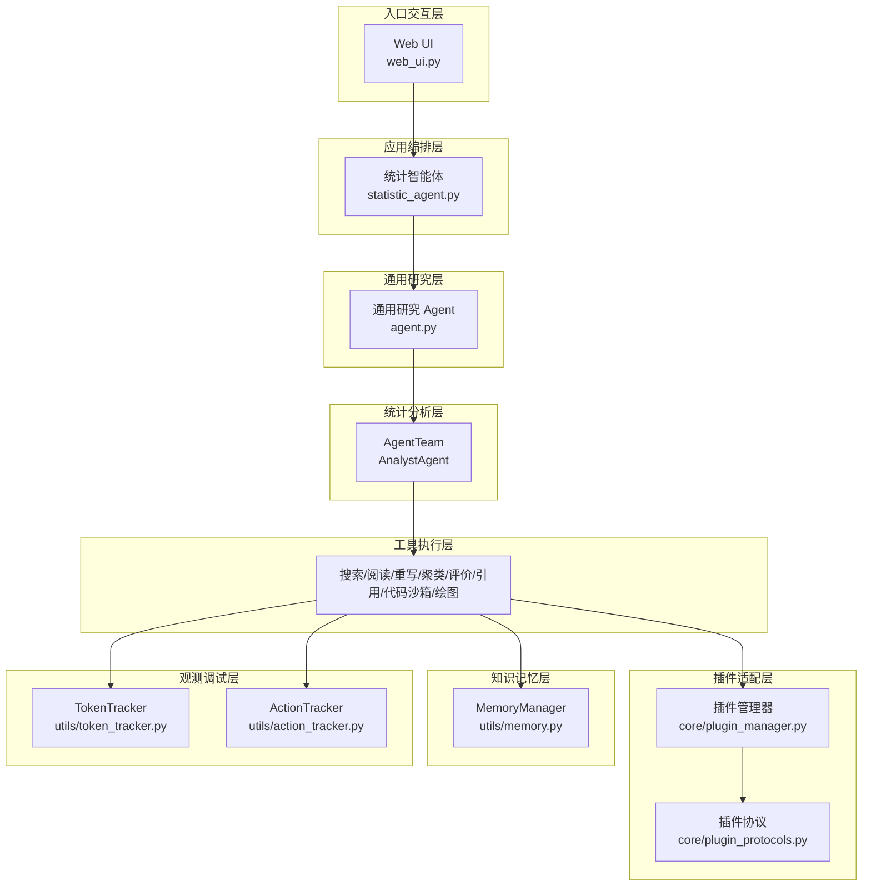
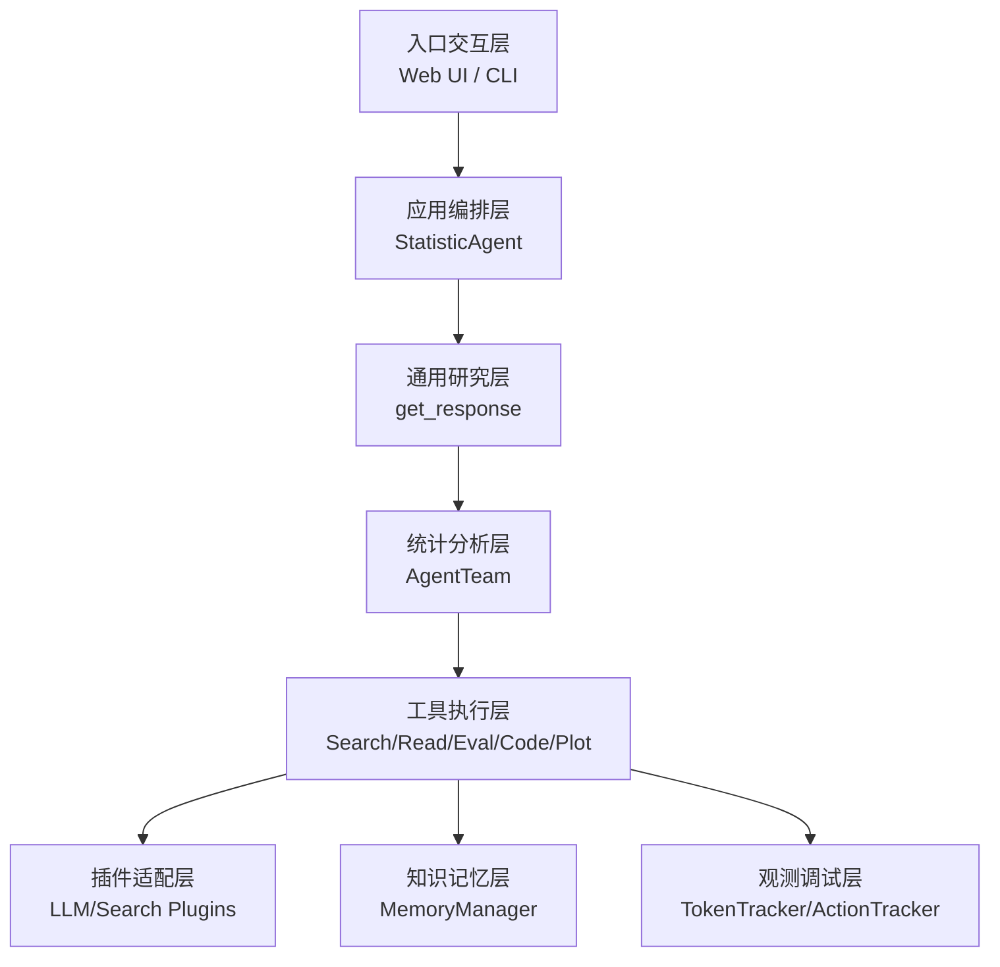
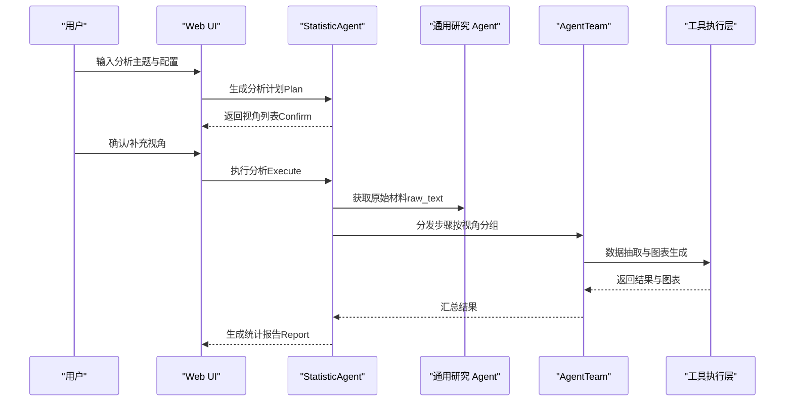
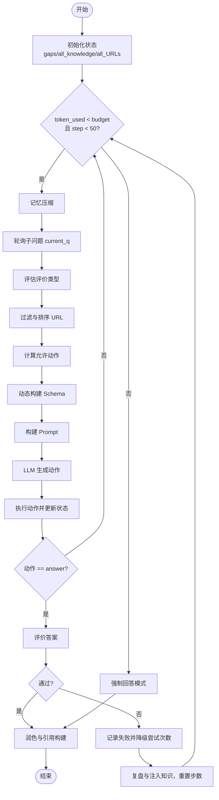
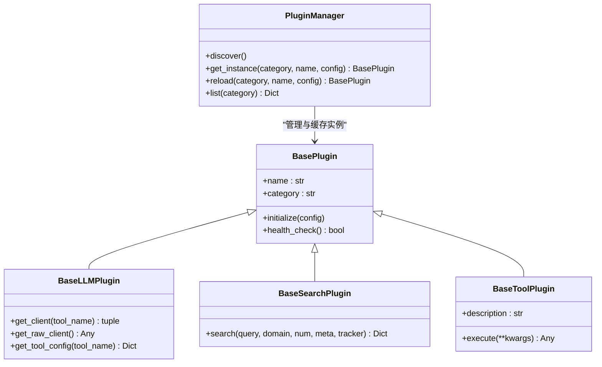
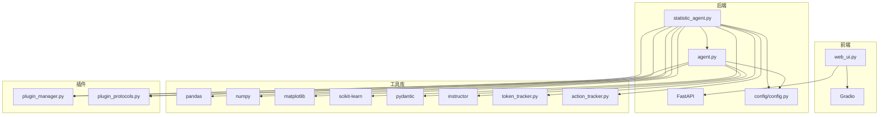

# 项目概述

<cite>
**本文档引用的文件**
- [DeepStatic_架构与实现详解报告.md](file://DeepStatic_架构与实现详解报告.md)
- [PLUGINS_GUIDE.md](file://PLUGINS_GUIDE.md)
- [requirements.txt](file://requirements.txt)
- [web_ui.py](file://web_ui.py)
- [statistic_agent.py](file://statistic_agent.py)
- [agent.py](file://agent.py)
- [core/plugin_manager.py](file://core/plugin_manager.py)
- [core/plugin_protocols.py](file://core/plugin_protocols.py)
- [config/config.py](file://config/config.py)
- [main.py](file://main.py)
</cite>

## 目录
1. [简介](#简介)
2. [项目结构](#项目结构)
3. [核心组件](#核心组件)
4. [架构总览](#架构总览)
5. [详细组件分析](#详细组件分析)
6. [依赖关系分析](#依赖关系分析)
7. [性能考量](#性能考量)
8. [故障排查指南](#故障排查指南)
9. [结论](#结论)
10. [附录](#附录)

## 简介
DeepStatic 是一个基于多阶段智能体的深度检索与统计报告自动生成系统，面向复杂研究与分析任务，提供从问题理解、信息检索、证据阅读、数据抽取、统计分析到报告生成的完整自动化闭环。系统通过动态动作选择机制、多维度答案评价与自我修正、记忆压缩策略、AgentTeam 并行分析与插件化适配等核心技术，实现对行业分析、历史研究、数据统计等多场景的高质量支持。

## 项目结构
项目采用八层架构设计，从上至下分别为：入口交互层、应用编排层、通用研究层、统计分析层、工具执行层、插件适配层、知识记忆层、观测调试层。核心模块包括：
- 入口交互层：Web UI（Gradio）与命令行
- 应用编排层：统计智能体（StatisticAgent）实现 Plan → Confirm → Execute → Report 四阶段
- 通用研究层：通用研究 Agent（get_response）实现动态动作选择与多轮推理
- 统计分析层：AgentTeam 并行执行数据抽取与图表生成
- 工具执行层：搜索、阅读、重写、聚类、评价、引用构建、代码沙箱、绘图等
- 插件适配层：LLM 与搜索插件的协议化适配
- 知识记忆层：MemoryManager 统一管理检索知识并压缩
- 观测调试层：TokenTracker 与 ActionTracker 记录成本与轨迹

**图表来源**
- [DeepStatic_架构与实现详解报告.md: 第63-104节:63-104](file://DeepStatic_架构与实现详解报告.md#L63-L104)
- [web_ui.py: 第260-667节:260-667](file://web_ui.py#L260-L667)
- [statistic_agent.py: 第187-674节:187-674](file://statistic_agent.py#L187-L674)
- [agent.py: 第483-800节:483-800](file://agent.py#L483-L800)
- [core/plugin_manager.py: 第20-121节:20-121](file://core/plugin_manager.py#L20-L121)
- [core/plugin_protocols.py: 第9-99节:9-99](file://core/plugin_protocols.py#L9-L99)

**章节来源**
- [DeepStatic_架构与实现详解报告.md: 第63-104节:63-104](file://DeepStatic_架构与实现详解报告.md#L63-L104)
- [web_ui.py: 第260-667节:260-667](file://web_ui.py#L260-L667)

## 核心组件
- 统计智能体（StatisticAgent）：实现 Plan-Confirm-Execute-Report 四阶段流程，支持多种分析模式（报告生成、归因分析、数据生成），并提供 AgentTeam 并行分析与可视化。
- 通用研究 Agent：通过动态动作选择（搜索、访问、反思、编程、回答）与多轮推理，结合评价-修正闭环，实现高质量答案生成。
- 插件化系统：通过插件协议与管理器，支持多 LLM 与多搜索引擎的灵活切换与扩展。
- 记忆压缩与上下文管理：MemoryManager 在多轮检索中压缩历史知识，控制上下文长度。
- 观测与调试：TokenTracker 与 ActionTracker 记录调用成本与执行轨迹，便于复盘与优化。

**章节来源**
- [statistic_agent.py: 第187-674节:187-674](file://statistic_agent.py#L187-L674)
- [agent.py: 第483-800节:483-800](file://agent.py#L483-L800)
- [core/plugin_manager.py: 第20-121节:20-121](file://core/plugin_manager.py#L20-L121)
- [core/plugin_protocols.py: 第9-99节:9-99](file://core/plugin_protocols.py#L9-L99)

## 架构总览
系统采用八层架构，强调分层解耦与可扩展性。入口交互层负责用户输入与结果展示；应用编排层将产品目标转化为可执行流程；通用研究层通过动态动作选择与评价闭环实现多轮推理；统计分析层以 AgentTeam 并行执行数据抽取与图表生成；工具执行层提供各类具体能力；插件适配层通过协议化实现多服务商适配；知识记忆层管理检索知识并压缩；观测调试层记录成本与轨迹。

**图表来源**
- [DeepStatic_架构与实现详解报告.md: 第63-104节:63-104](file://DeepStatic_架构与实现详解报告.md#L63-L104)

**章节来源**
- [DeepStatic_架构与实现详解报告.md: 第63-104节:63-104](file://DeepStatic_架构与实现详解报告.md#L63-L104)

## 详细组件分析

### 统计智能体（StatisticAgent）
- 四阶段流程：Plan → Confirm → Execute → Report。Plan 阶段生成分析视角；Confirm 阶段用户确认/补充；Execute 阶段并行执行数据抽取与可视化；Report 阶段生成 Markdown 报告。
- 分析模式：报告生成（综合多视角）、归因分析（聚焦指标波动原因）、数据生成（结构化提取与描述性统计）。
- 并行分析：AgentTeam 将步骤按视角分组，每个 AnalystAgent 负责一个视角的完整链路，视角之间并行执行，提升效率。
- 代码沙箱：AnalysisCodeSandbox 生成并执行 Python 绘图代码，支持描述统计、回归分析、分类分析、时间序列与对比分析等。

**图表来源**
- [statistic_agent.py: 第187-674节:187-674](file://statistic_agent.py#L187-L674)
- [web_ui.py: 第478-667节:478-667](file://web_ui.py#L478-L667)

**章节来源**
- [statistic_agent.py: 第187-674节:187-674](file://statistic_agent.py#L187-L674)
- [web_ui.py: 第478-667节:478-667](file://web_ui.py#L478-L667)

### 通用研究 Agent（动态动作选择与评价闭环）
- 动态动作选择：根据知识状态、URL 池、评价类型与预算，动态生成 Pydantic Schema 约束动作（搜索、访问、反思、编程、回答），减少非法输出概率。
- 多维度评价与修正：包括确定性、时效性、多样性、完整性与严格性五种评价类型，未通过时记录失败原因、降低尝试次数、生成改进计划并重置步数进入新一轮搜索-推理。
- 记忆压缩：MemoryManager 在多轮检索中压缩历史知识，保留近期条目并用 LLM 摘要替代，控制上下文长度。
- Beast Mode：当预算耗尽或尝试次数耗尽时，系统进入强制回答模式，基于已有知识生成最终答案。

**图表来源**
- [agent.py: 第507-800节:507-800](file://agent.py#L507-L800)
- [DeepStatic_架构与实现详解报告.md: 第159-189节:159-189](file://DeepStatic_架构与实现详解报告.md#L159-L189)

**章节来源**
- [agent.py: 第507-800节:507-800](file://agent.py#L507-L800)
- [DeepStatic_架构与实现详解报告.md: 第159-189节:159-189](file://DeepStatic_架构与实现详解报告.md#L159-L189)

### 插件化系统（LLM 与搜索）
- 协议与基类：通过 BasePlugin、BaseLLMPlugin、BaseSearchPlugin、BaseToolPlugin 定义统一接口，确保插件一致性。
- 管理与发现：PluginManager 自动扫描 plugins/ 目录，导入模块时通过装饰器注册，支持延迟实例化与缓存。
- 配置与运行：支持环境变量与 settings.json 配置，动态读取 LLM 与搜索提供商、URL 与 API Key，前端可即时切换。

**图表来源**
- [core/plugin_protocols.py: 第9-99节:9-99](file://core/plugin_protocols.py#L9-L99)
- [core/plugin_manager.py: 第20-121节:20-121](file://core/plugin_manager.py#L20-L121)

**章节来源**
- [core/plugin_protocols.py: 第9-99节:9-99](file://core/plugin_protocols.py#L9-L99)
- [core/plugin_manager.py: 第20-121节:20-121](file://core/plugin_manager.py#L20-L121)
- [PLUGINS_GUIDE.md: 第1-160节:1-160](file://PLUGINS_GUIDE.md#L1-L160)

### Web UI 与运行方式
- 前端界面：基于 Gradio Blocks，提供任务选择、输入卡片、上传数据、高级设置、计划展示、执行进度与报告预览等功能。
- 运行方式：支持命令行与 Web UI 两种入口，前端可动态切换搜索提供商与 LLM 提供商、URL 与 API Key，并即时应用到运行时。

**章节来源**
- [web_ui.py: 第260-667节:260-667](file://web_ui.py#L260-L667)

## 依赖关系分析
系统技术栈以 Python 为核心，结合 FastAPI、Gradio、OpenAI、Pydantic、instructor、pandas、numpy、matplotlib 等关键组件，形成前后端分离、结构化输出、可视化与插件化适配的完整生态。

**图表来源**
- [requirements.txt: 第1-111节:1-111](file://requirements.txt#L1-L111)
- [web_ui.py: 第260-667节:260-667](file://web_ui.py#L260-L667)
- [statistic_agent.py: 第187-674节:187-674](file://statistic_agent.py#L187-L674)
- [agent.py: 第483-800节:483-800](file://agent.py#L483-L800)
- [config/config.py: 第1-155节:1-155](file://config/config.py#L1-L155)

**章节来源**
- [requirements.txt: 第1-111节:1-111](file://requirements.txt#L1-L111)
- [config/config.py: 第1-155节:1-155](file://config/config.py#L1-L155)

## 性能考量
- 并行与并发：AgentTeam 通过 Semaphore 控制并发，避免对 LLM 服务造成过大压力；底层模型调用通过线程池执行，避免事件循环阻塞。
- Token 预算与上下文：全局 TokenTracker 记录调用成本，主循环在达到预算 85% 时进入强制回答模式；MemoryManager 压缩历史知识，控制上下文长度。
- 前端流式反馈：Web UI 使用异步生成器与队列实现进度推送，避免长任务期间界面假死。
- 可扩展性：插件机制支持多 LLM 与多搜索引擎的灵活切换，便于在不同场景下优化成本与性能。

**章节来源**
- [statistic_agent.py: 第444-458节:444-458](file://statistic_agent.py#L444-L458)
- [agent.py: 第619-632节:619-632](file://agent.py#L619-L632)
- [DeepStatic_架构与实现详解报告.md: 第419-429节:419-429](file://DeepStatic_架构与实现详解报告.md#L419-L429)

## 故障排查指南
- 插件加载失败：检查插件目录与装饰器注册是否正确，确认环境变量与配置文件设置。
- API Key 与 URL 配置：确认 LLM 与搜索提供商的 API Key 与 base_url 设置正确，必要时通过前端即时应用并重建插件实例。
- Token 预算不足：适当提高 TOKEN_BUDGET，或在预算耗尽时启用 Beast Mode 强制回答。
- 并发过高：调整 TEAM_SIZE 与 STEP_SLEEP，避免对 LLM 服务造成过大压力。
- 引用与报告：若引用不可靠，考虑引入证据对象模型与前验引用机制；对于代码沙箱安全，建议在受控环境中执行或引入进程隔离。

**章节来源**
- [PLUGINS_GUIDE.md: 第79-160节:79-160](file://PLUGINS_GUIDE.md#L79-L160)
- [config/config.py: 第60-155节:60-155](file://config/config.py#L60-L155)
- [agent.py: 第619-632节:619-632](file://agent.py#L619-L632)

## 结论
DeepStatic 通过动态动作选择、评价-修正闭环、记忆压缩、AgentTeam 并行与插件化适配，实现了从复杂问题理解到统计报告生成的完整自动化闭环。系统在行业分析、历史研究、数据统计等多场景中展现出良好的适用性，具备端到端自动化、自适应决策、质量保证与可扩展性等优势。未来将持续改进证据链可信度、数据质量校验与系统架构模块化，推动从研究原型向可靠分析工具平台演进。

## 附录
- 关键模块与职责概览：见附录 A（系统模块清单）
- 关键配置参数：见附录 B（关键配置参数）

**章节来源**
- [DeepStatic_架构与实现详解报告.md: 第546-587节:546-587](file://DeepStatic_架构与实现详解报告.md#L546-L587)