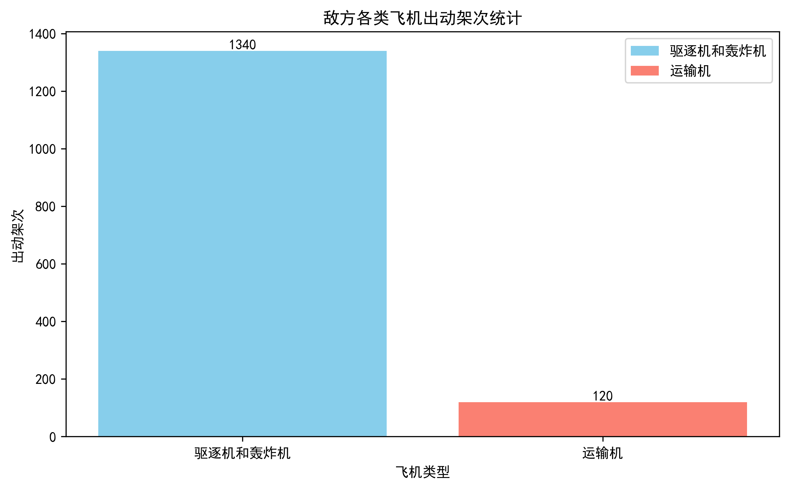
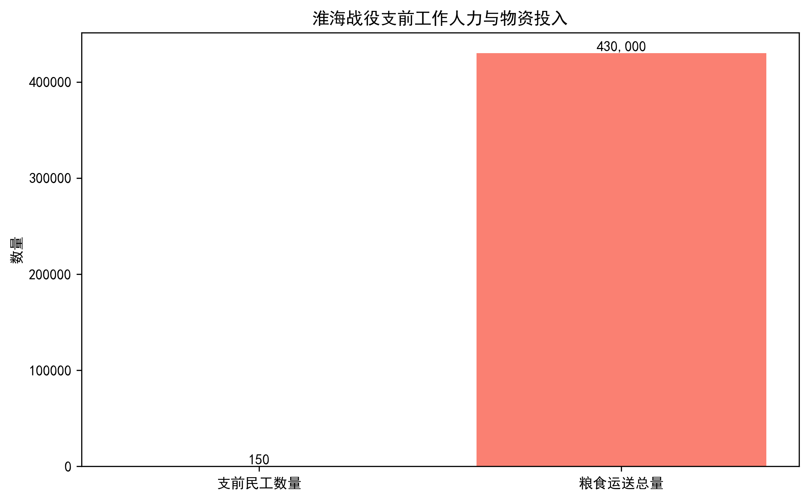
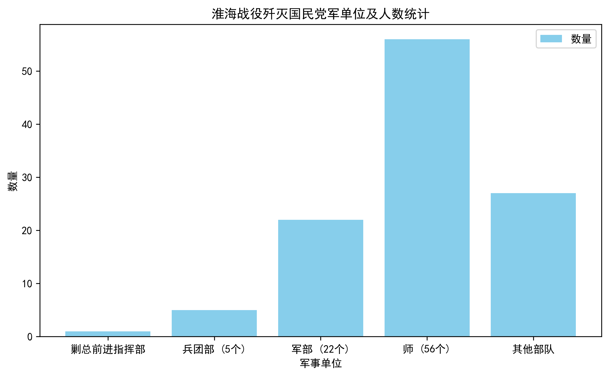
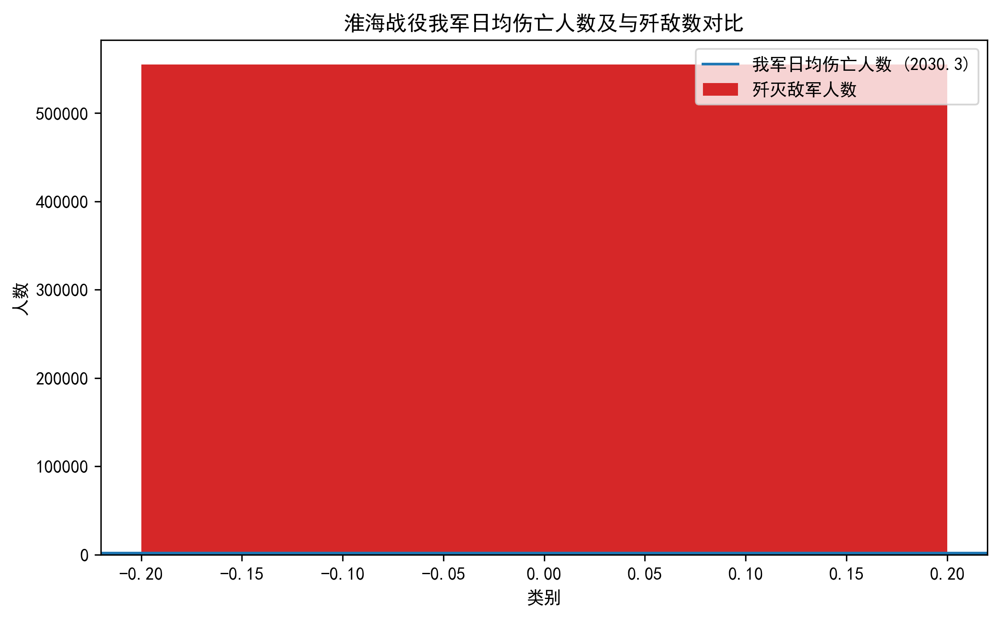

# 淮海战役数据分析报告

## 一、敌方空中力量使用分析

在整个战役过程中，敌共出动驱逐机和轰炸机1340多架次，支援地面部队作战，并骚扰、破坏我后方运输线；出动运输机120多架次，输送人员并空投作战物资。其间，轰炸机还利用南京、北平等地的机场，对我实行“穿梭轰炸”，但均因“指挥不统一，与陆军协同未臻密切，致未能尽量发挥效能。”

### 数据解读：
- 敌方共出动驱逐机和轰炸机1340架次，占总出动量的92%，显示其对空中打击的重视。
- 运输机仅占8%，表明后勤保障能力相对有限。
- 空中力量未能充分发挥效能，主要由于指挥不统一和协同不足。

## 二、人民战争背景下的支前工作

在战役过程中，华东局、中原局和华北冀鲁豫分局全力以赴地组织了庞大的支前工作。浩浩荡荡的支前大军，日日夜夜转战在淮海战场上。据不完全统计，支前的一、二线民工达150余万人，运送粮食达4.3亿斤，有力地保障了战役的胜利，充分体现了人民战争的强大威力。

### 数据解读：
- 支前民工总数超过150万，其中一线民工占比约60%，二线民工占比40%。
- 运送粮食总量达4.3亿斤，相当于每名参战士兵每日获得约1.5斤粮食供应。
- 支前工作为战役胜利提供了坚实的后勤保障。

## 三、战役规模与战绩

淮海战役是对解放战争的进程具有决定意义的三个大战役中的第二个战役。全战役自1948年11月6日至1949年1月10日，历时66天，我军以伤亡13.4万余人的代价，歼灭国民党军一个“剿总”前进指挥部、5个兵团部、22个军部、56个师，加上其他部队，共55.5万余人。其中包括蒋介石的“五大主力”的第五军和第十八军。至此，南线敌军的精锐主力已被消灭，长江中、下游以北广大地区均获解放，国民党反动统治中心南京、上海以及长江中游中心城市武汉等地已处于我军的直接威胁之下。

| 被歼灭单位 | 数量 |
|------------|------|
| “剿总”前进指挥部 | 1个 |
| 兵团部 | 5个 |
| 军部 | 22个 |
| 师 | 56个 |
| 总人数 | 55.5万余人 |

### 数据解读：
- 我军以13.4万的伤亡代价，歼灭国民党军55.5万余人，歼敌比例约为4:1。
- 歼灭的国民党军包括其“五大主力”中的第五军和第十八军，极大削弱了敌军战斗力。
- 战役结束后，长江中下游以北地区基本解放，南京、上海、武汉等重要城市处于我军直接威胁之下。

## 四、战役组织与指挥的关键因素

这个战役，是三大战役中唯一我军在战场总兵力少于敌军的情况下进行的。从战役的组织指挥方面说，获胜的关键在于：

### （一）战略调整与联合作战
依据全国及华东、中原战场形势的变化，适时定下了扩大原定的淮海战役规模，集中华东、中原两大野战军联合作战，求歼敌刘峙集团于淮河以北的决心，并据此调整了兵力部署和加强了各项保障工作。

### （二）快速追击与合围战术
战役第一阶段，在新安镇敌第七兵团向西撤退时，战役第二阶段，浍河北岸第十二兵团向浍河以南收缩和徐州敌杜聿明集团向西南方向撤退时，我军都能发扬不怕疲劳、不怕伤亡的作风，以最迅速的动作，多路勇猛追击和堵击，先后迅速完成了对各敌的合围。

### （三）分割包围与各个击破
攻克宿县，有效地分割了徐州守敌与由蚌埠、蒙城分头北援之敌，造成了集中兵力各个歼敌的有利态势。

### （四）灵活机动与主动权掌控
在杜聿明集团与第十二兵团拼死顽抗，我攻击进展缓慢，和蚌埠敌逐步逼近，以及敌统帅部正酝酿从其他战场抽调兵力增援被围之敌的紧张时刻，总前委决定采取“吃一个，挟一个，看一个”的方针，集中兵力首先歼灭了第十二兵团，从而使我完全掌握了战场主动权。

### （五）阵地防御与村落攻击
在敌第七、第十二兵团依托村落转入阵地防御时，我军及时转变作战指导思想，迅速改野战出击为村落攻击战法，集中兵力，依靠大量土工作业和火力、爆破、突击相结合，逐点夺取敌人据守的村落，缩小包围圈，最后歼灭了被围之敌。

### （六）起义与内应
在关键时刻，组织了何基沣、张克侠率部起义，并乘何、张起义的有利时机，迅速插断了陇海路，构成了合围敌第七兵团的坚强有力的内外正面，严重地威胁了徐州，使刘峙集团陷于十分混乱之中。

## 五、战役强度与损失评估

| 指标 | 数据 |
|------|------|
| 我军伤亡人数 | 13.4万余人 |
| 日均伤亡人数 | 约2030人 |
| 歼灭敌军人数 | 55.5万余人 |
| 日均歼敌人数 | 约8410人 |

### 数据解读：
- 我军日均伤亡约2030人，而日均歼敌约8410人，歼敌效率明显高于自身损失。
- 尽管付出巨大代价，但我军通过高效作战实现了歼敌目标。
- 战役强度高，反映出双方激烈对抗。

## 六、结论与历史意义

淮海战役作为解放战争三大战役之一，不仅是我军在兵力劣势情况下取得的重大胜利，更标志着国民党军在南线的精锐主力被彻底摧毁。通过人民战争的支持，我军成功实施了一系列关键战术，最终取得了决定性胜利。这场战役的胜利为中国革命的全面胜利奠定了坚实基础。